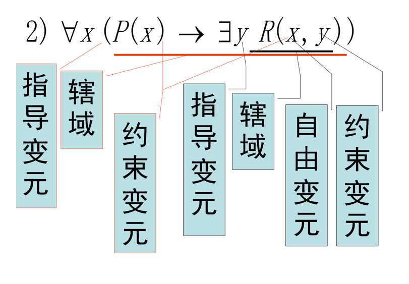

# 谓词逻辑

***Predicate logic***

## 谓词

***Predicates***

>**Predicate 谓词**
>
>A predicate is a symbol that represents a property or a relation.

>***E.g***
>
>For the statement “$x$ is greater than $3$”, The variable $x$ is the subject of the statement, while the **predicate** “is greater than $3$”—refers to a property that the subject of the statement can have. We can denote the statement by $P(x)$, where $P$ denotes the predicate “is greater than $3$” and $x$ is the variable.

**tips**: We call $P(x)$ as **propositional function(命题函数)**, once $x$ has been signed a value, the $P(x)$ **becomes a proposition with a truth value**.

**tips**: Similarly, in formula $P(a,b)$, the symbol $P$ is a predicate that applies to the individual constants $a$ and $b$​.

**tips**: For $n$-prediacates($n$-palce predicate or $n$-ary predicate), e.g $P(x_1,x_2, \dots,x_n)$, it also becomes a proposition if $n = 0$​.

>***Defination***
>
>**Universe of discourse, or domain**
>
>**个体域**
>
>即个体变量 $x$ 可以选择的范围. 每一个个体变量都有自己的个体域, 如果没有特别指定, 则缺省为一个**全个体域**(total universe of discourse), 任意个体均可以代入 $x$​.
>
>指定个体域之后, 将每一个个体 $a$ 代入, $P(a)$​ 就成为一个可以判定真假意义的**命题**. 

>***Defination***
>
>**谓词公式**
>
>我们定义谓词公式为
>
>1. $n$ 元谓词是一个谓词公式.
>2. $P$ 是谓词公式, 则 $\neg P$ 亦是.
>3. 若 $A, B$ 为谓词公式, 则将 $A, B$ 用逻辑运算符连接起来, 仍是谓词公式.
>4. 若 $P$ 是谓词公式且含有未被量化的个体变量 $x$, 则
>     $\forall x P(x), \exists x P(x)$ 也是谓词公式
>5. 有限次使用 1. 到 4. 所得到的也是谓词公式.

## 量词

***Quantifiers***

The quantifiers $\forall$ and $\exists$ have higher precedence than all logical operators from propositional calculus.

下文介绍的存在量词和全称量词拥有**最高的优先级**.

### 全称量化

***universal quanification***

>**universal quanification**
>
>**全称量化**
>
>A mathematical statements assert that a property is true for **all** values of a variable in a particular domain, which is expressed using **universal quantification**. We notate like
>$$
>\forall xP(x)
>$$
>to express the universal quantification of $P(x)$. 

**tips**: The meaning of the universal quantification of $P(x)$ changes when we change the domain. The domain must always be specified when a universal quantifier is used; without it, the universal quantification of a statement is not defined.

**tips**: An element for which $P(x)$​ is false is called a ***counterexample***.

**tips:** We can express universal quanification in many ways like "for all", "for each", "for every", "all of", "given any", "for arbitrary" and "for any".

**tips**: Avoid using "for any" because it is often ambiguous as to whether “any” means “every” or “some.” 

>***E.g***
>
>"Every student in this class has studied calculus."
>
>It can be written as
>$$
>\forall x (S(x) \to P(x))
>$$
>$P(x) =$ "$x$ has studied calculus.", $S(x) =$ "$x$ is in this class."

### 存在量化

***exitential quantification***

>**exitential quantification**
>
>**存在量化**
>
>We notate like 
>$$
>\exists xP(x)
>$$
>to express the existential quantification of $P(x)$.

**tips**: We can also express exitential quantification in many other ways like "there exists", "for some", "for at least one" or "there is." 

### 唯一量词

***Uniqueness quantifier***

>**Uniqueness quantifier**
>
>**唯一量词**
>
>We denote "There exists a **unique** $x$ such that $P(x)$ is true." or "There is one and only one $x$ such that $P(x)$ is ture" like
>$$
>\exists!x P(x)[or\ \exists_1 xP(x)]
>$$

**tips**: It can be also expressed like
$$
\exists x (P(x) \land \forall y(P(y)\to x=y))
$$

## 变量的约束

***Binding variables***

>***Defination***
>
>**Bound variable and free variable**
>
>约束变量, 自由变量
>
>When a quantifier is used on the variable $x$​​, we say that this occurrence of the variable is **bound**(约束) while an ocurrence of a variable is not bound by a quantifier or set equal to a particular value is said to be **free**(自由).

**tips:** 我们称跟在量词后的变元为作用变元或者**指导变元**.

>***E.g***
>
>

**tips**: 引入**辖域或者作用域(scope)**的概念.The part of a logical expression to which a quantifier is applied is called the **scope** of this quantifier, e.g the $P(x)$ in $\forall xP(x)$.

## 翻译谓词公式, 语句形式化

### 解释谓词公式

对一个谓词公式的解释(interpret)包括

- 个体域
- 谓词
- 函数
- 个体常项

的具体含义.

### 语句形式化

We learn this from some important examples.

>***E.g*** **1**
>
>**全称蕴涵**
>
>Express the statement "Every student in this class has studied calculus."
>$$
>\forall x(S(x) \to C(x))
>$$
>$S(x) =$" $x$ is in this class."
>
>$C(x)=$" $x$ has studied calculus." 

>***E.g*** **2**
>
>**存在合取**
>
>Express the statements "Some student in this class has visited Mexico."
>$$
>\exists x(S(x) \land M(x))
>$$
>$S(x) =$" $x$ is in this class."
>
>$M(x)=$" $x$ has visited Mexico."

>***E.g*** **3**
>
>**有且只有两个**
>
>Express the statements “there exist exactly two objects with property $P$.”
>$$
>\exists x\exists y(P(x) \land P(y) \land x \neq y \land \forall z (P(z) \to (z=x\lor z=y))
>$$
>

>***E.g*** **4**
>
>**有且只有一个**
>
>Express the statement "Everyone has exactly one best friend."
>$$
>\forall x \exists y \forall z(B(x,y) \land ((z \neq y) \to \neg B(x,z)))
>$$
>$B(x, y)=$" $x$ and $y$ are friends."

>***E.g*** **5**
>
>**"if some" 表示任意**
>
>Express the statement "If somebody is female and is a parent, then this person is someone's mother"
>$$
>\forall x(F(x)\land P(x)\to \exists yM(x, y))
>$$
>$F(x)=$​ "$x$​ is female."
>
>$P(x)=$ "$x$ is parent."
>
>$M(x,y)=$ "$x$ is $y$'s mother."

>***E.g*** **6**
>
>**量词的顺序**
>
>Express the statement "There is a woman who has taken a flight on every airline in the world."
>$$
>\exists w \forall a \exists f(P(w,f) \land Q(f, a))
>$$
>$P(w,f)=$ "$w$ has taken $f$."
>
>$Q(f,a )=$ "$f$ is a flight on $a$."

**tips**: 量词的顺序**不可随意更换**, 否则会改变谓词公式的意义.
