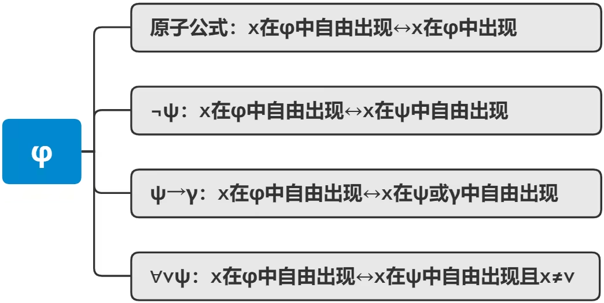
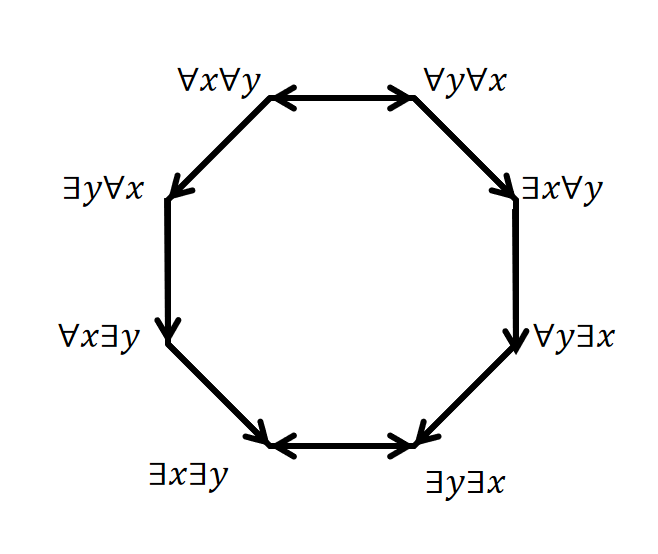

# 嵌套量词

***Nested Quantifiers***

If one quantifier is within the scope of another, we call it **nested quantifier(嵌套谓词)**, e.g
$$
\forall x\forall y(x+y=0).
$$

>***E.g***
>
>If we want to express "Everyone has someone whom they like."
>
>Let
>
>$L(x,y)=$"$x$ likes $y$."
>
>Then
>
>$\exists y \,L(x,y)=$"There is someone whom $x$ likes."
>
>Then
>
>$\forall x(\exists y \,L(x,y))=$"Everyone has someone whom they like."

## 量词等价法则

***Quantifier Equivalence Laws***

If we suppose universe of discource be $a,b,c,\dots$

then we have

>$$
>\forall x P(x) \equiv P(a) \land P(b) \land P(c) \land \cdots
>$$
>
>$$
>\exists x P(x) \equiv P(a) \lor P(b) \lor P(c) \lor \cdots
>$$

From those, we can prove the following laws with **DeMorgan's laws**:

>$$
>\forall x P(x) \equiv \neg \exists x \neg P(x)
>$$
>
>$$
>\exists x P(x) \equiv \neg \forall x \neg P(x)
>$$

The proof is trivial.

We have more **Important** **Equivalence Laws** like

>$$
>\forall x \forall y P(x,y) \equiv \forall y \forall x P(x,y)
>$$
>
>$$
>\exists x \exists y P(x,y)  \equiv  \exists y \exists x P(x,y)
>$$

 

>$$
>\forall x(P(x)\land Q(x)) \equiv \forall x P(x) \land \forall x Q(x)
>$$
>
>$$
>\exists x(P(x)\lor Q(x)) \equiv \exists x P(x) \lor \exists x Q(x)
>$$

## 一阶逻辑等值式

***First-order Logical Equivalence***

### 代换实例

>***Definition***
>
>**代换实例**
>
>在命题逻辑等值式中, 代入一阶逻辑公式所得到的式子, 称为原来公式的代换实例.

>***E.g***
>
>For
>$$
>A \equiv \neg \neg A.
>$$
>We let 
>$$
>A=\forall x F(x)
>$$
>then we have 
>$$
>\forall x F(x) \equiv \neg \neg \forall x F(x).
>$$

### 有限个体域上消去量词

***Eliminating Quantifiers in Finite u.d.***

Let universe of discourse be
$$
\{a_1,a_2,a_3,\dots,a_n\}
$$
then
$$
\forall x P(x) \equiv P(a) \land P(b) \land P(c) \land \cdots
\\
\exists x P(x) \equiv P(a) \lor P(b) \lor P(c) \lor \cdots
$$

### 量词否定等值式

***Negation Equivalences***

>$$
>\neg \forall x P(x) \equiv \exists x \neg P(x)
>$$
>
>$$
>\neg \exists x P(x) \equiv \forall x \neg P(x)
>$$

 

### 量词辖域的收缩与扩张

***Contraction and Expansion of Scope***

Suppose the truth of $B$ is independent of $x$.

#### 任意

***Forall***

>$$
>\forall x(A(x) \land B) \equiv \forall x A(x) \land B
>$$
>
>$$
>\forall x(A(x) \lor B) \equiv \forall x A(x) \lor B
>$$
>
>$$
>\forall x(A(x) \to B) \equiv \exists x A(x) \to B
>$$
>
>$$
>\forall x (B \to A(x)) \equiv B \to  \forall xA(x)
>$$

tips: pay attention to the third:

$\forall x(A(x) \to B) \equiv \exists x A(x) \to B$​

tips: 不要试图去找自然语言的例子, 这会让你感到非常奇怪...因为对 $A \to B$, $A$ 为假时该蕴涵式永真, 而我们平时使用蕴涵关系时, 常常假设 $A$ 为真.

#### 存在

***Exist***

>$$
>\exists x(A(x) \land B) \equiv \exists x A(x) \land B
>$$
>
>$$
>\exists x(A(x) \lor B) \equiv \exists x A(x) \lor B
>$$
>
>$$
>\exists x(A(x) \to B) \equiv \forall x A(x) \to B
>$$
>
>$$
>\exists x (B \to A(x)) \equiv B \to  \exists  xA(x)
>$$

### 量词分配

>$$
>\forall x(P(x)\land Q(x)) \equiv \forall x P(x) \land \forall x Q(x)
>$$
>
>$$
>\exists x(P(x)\lor Q(x)) \equiv \exists x P(x) \lor \exists x Q(x)
>$$

### 换名规则

***Rule of Renaming***

>**Rule of Renaming 换名规则 **
>
>把某个**指导变项**及其**辖域**中所有的同名的约束出现, 都换成某个新的个体变项符号.

>***E.g***
>$$
>\forall x (A(x)\land B(x)) \equiv \forall y (A(y) \land B(y))
>$$

tips: 我们补充几个数理逻辑的定义

- **Free occurrence 自由出现**:一个公式里出现的变元, 只要没有出现在量词的后面, 或者其在量词的作用域外出现, 就是**自由出现**.
  使用如下的规则[^1]来递归定义"变元 $x$ 在(谓词)公式 $\varphi$ 中自由出现", 其中的"原子公式","$\psi$"等代表有 $x$ 出现的子公式:
  
  
  
- **Bounded occurrence 约束出现**: 当一个变元 $x$ 在公式 $\varphi$ 中出现, 只要不是自由出现, 就是**约束出现**.

### 代替规则

***Rule of Substitution***

>**Rule of Substitution 代替规则**
>
>把某个自由变项的所有出现, 都换成新的个体变项符号

>***E.g***
>$$
>\forall x A(x) \land B(x) \equiv \forall x A(x) \land  B(y)
>$$

### 含量词的蕴含式与等价式

Just remember:

tip: 对于 $\exists y \forall x \to \forall x \exists y$​, 比较好的例子是: 一元函数的**一致连续性**是比**连续性**更强的条件; 函数列**一致收敛**是比**处处收敛**更强的条件.

### 前束范式

***Prenex Normal Form***

>***Definition***
>
>**prenex normal forms 前束范式**
>
>一个公式为**前束范式**, 如果量词均在全式的开头，作用域延伸到整个公式的末尾.

>***E.g***
>$$
>\forall x \forall y \forall z (P(x,y) \to Q(z))
>$$
>is a prenex normal form.

求取前束范式, 只需要将 $\neg$ 右移, 扩张或者收缩辖域, 然后应用换名规则, 代替规则和等值演算. 一般地, 

>- 任何一个谓词公式均有与其等价的**前束范式**.
>- 任何一个谓词公式均可转为与其等价的**前束合取范式**.
>- 任何一个谓词公式均可转为与其等价的**前束析取范式**.

[^1]: [【数理逻辑】学习笔记 017 自由出现和约束出现](https://www.bilibili.com/read/cv13694245/)
