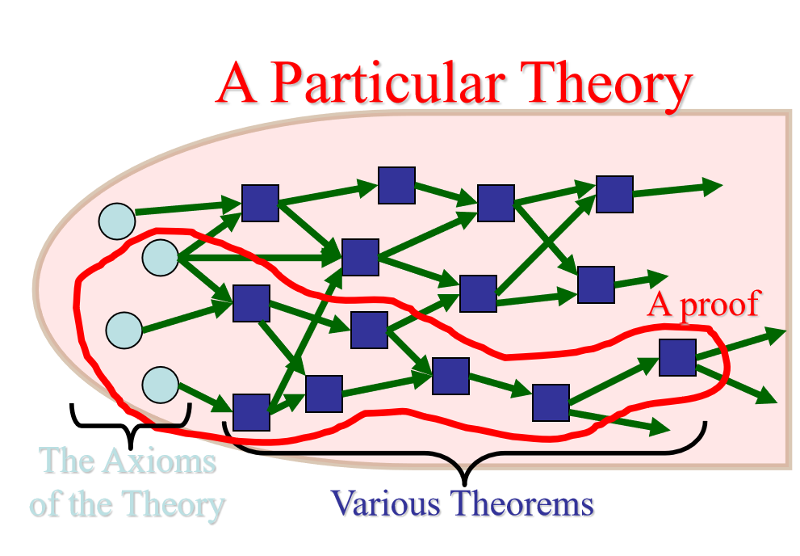

# 推理与证明

***Inference and Proof***

>**Terminology** **术语表**
>
>---
>
>**Theorem** **定理** - A statement that has been proven to be true.
>
>**Axioms, postulates, hypotheses, premises** **公理, 假定, 假设, 前提** - Assumptions (often unproven) defining the structures about which we are reasoning.
>
>**Rules of inference** **推理规则** - Patterns of logically valid deductions from hypotheses to conclusions. 
>
>**Lemma 引理** - A minor theorem used as a stepping-stone to proving a major theorem.
>
>**Corollary 推论** - A minor theorem proved as an easy consequence of a major theorem.
>
>**Conjecture 猜想** - A statement whose truth value has not been proven.(A conjecture may be widely believed to be true, regardless.)
>
>**Theory 理论** – The set of all theorems that can be proven from a given set of axioms.
>
>**Fallary 谬论** - Common forms of incorrect reasoning.
>
>**Deduction 推理**

## 推理规则

***Rules of Inference***

>***Definition***
>
>**argument 论证** - a sequence of statements that end with a conclusion.

上文我们已经提到了推理规则的概念, 它的格式大致为:

>$anecedent \ \ 1$
>
>$anecedent \ \ 2$
>
>---
>
>$\therefore consequent$

我们开始介绍推理规则:

>**Rule of Addition** **附加律**
>
>$p$
>
>---
>
>$\therefore p \lor q$

>**Rule of Simplification** **化简律**
>
>$p \land q$
>
>---
>
>$\therefore p$

>**Rule of Conjunction** **合取**
>
>$p$
>
>$q$
>
>---
>
>$\therefore p \land q$

>**modus ponens 假言推理**
>
>$p$
>
>$p \to q$
>
>---
>
>$\therefore q$

>**modus tollens 拒取式**
>
>$\neg q$
>
>$p \to q$
>
>---
>
>$\therefore \neg p$

>**Rule of hypothetical syllogism 假言三段论**
>
>$p \to q$
>
>$q \to r$
>
>---
>
>$\therefore  p\to r$

>**Rule of disjunctive syllogism 析取三段论**
>
>$p \lor q$
>
>$\neg p$
>
>---
>
>$\therefore q$

>**Resolution 消解原理**
>
>$p \lor q$
>
>$\neg p \lor r$
>
>---
>
>$\therefore q \lor r$

>**等价三段论**
>
>$p \leftrightarrow q$
>
>$q \leftrightarrow r$
>
>---
>
>$\therefore p \leftrightarrow r$

>**Constructive dilemma 构造性两难**
>
>$(A\to B)∧(C→D)∧(A∨C) \Rightarrow (B∨D)$

>**Destructive dilemma 破坏性两难**
>
>$(A→B)∧(C→D)∧(¬B∨¬D) \Rightarrow (¬A∨¬C)$

### 推理定律

***deduction laws***

以上介绍的, 既是推理规则, 也是**推理定律(deduction laws)**, 对于后者, 我们补充一个概念:

- 推出: $A \Rightarrow B$

  读作 $A$ 推出 $B$, 含义为 $A$ 为真时, $B$ 为真.

  $A \Rightarrow B$ 当且仅当 $A \to B$ 永真.

因此, **推理定律就定义为永真的蕴取式**. 而推理规则是在证明过程中使用的规则. 一般说来, **每一条推理定律都可以作为推理规则**, 但是有些推理规则不是推理定律. 对于**推理规则**, 我们还有:

>**CP(Conditional Proof)规则, 或*附加前提推理规则***
>
>如果 $A \land B \Rightarrow C$, 则 $A \Rightarrow B \to C$​

>**P规则**
>
>即前提引入.

跟据定义, 我们可以知道, **一阶逻辑推理定律**可以用等值式生成. 在后文, 我们会补充关于量词的推理规则.

## 对量词的推理规则

***Inference Rules for Quantifiers***

### UI规则

>***Definition***
>
>**UI, or universal instantiation**
>
>**全称量词消去规则**
>
>$\forall x A(x)$
>
>---
>
>$\therefore A(y)$​
>
>
>
>或者
>
>$\forall x A(x)$
>
>---
>
>$\therefore A(c)$

tips: 此处, $y$ 是自由变项, $c$ 是个体常项.

### UG规则

>***Definition***
>
>**UG, or universal generalization**
>
>**全称量词引入规则**
>
>$A(y)$
>
>---
>
>$\therefore\forall x A(x)$

tips: $y$ 是自由变项.

### EI规则

>***Definition***
>
>**EI, or existential instantiation**
>
>**存在量词消去规则**
>
>$\exists x A(x)$
>
>---
>
>$\therefore A(c)$

tips: $c$ 是特定的满足 $A$ 的个体常项.

### EG规则

>**EG, or existential generalization**
>
>**存在量词引入规则**
>
>$A(c)$
>
>---
>
>$\therefore  \exists x A(x)$

---

## 证明初步

***Introduction to Proofs***

>**Direct proof 直接证明**
>
>$p \to q$

>**Indirect proof 间接证明**, 或者**反证法(contradiction)**
>
>$p \to q \Leftrightarrow \neg q \to \neg p$

>**Vacuous proof** **空证明**
>
>$p \to q$, 证明 $p$ 永假.

>**Trivial proof 平凡证明**
>
>$p \to q$, 证明 $q$ 永真.

>**Proof by contraposition** **归谬法**
>
>$p \Leftrightarrow \neg p \to r \land \neg r$ 
>
>(或者推出其它永假式).

>**Proof of cases 分例证明**
>
>$p_1 \lor p_2 \lor \dots \lor p_n \to q \Leftrightarrow$
>
>$(p_1 \to q) \land (p_2 \to q) \land \cdots \land (p_n \to q)$

### 存在证明

***Existence proof***

>**Constructive Proof 构造性证明**
>
>对于含"存在"的命题, 只需要找到符合该命题的一个例子.
>
>For $\exists xP(x)$, if the proof demonstrates how to actually find or construct a specific element $a$ such that $P(a)$ is true, then it is a constructive proof.

我们来看一个经典的问题.

>***E.g*** **1**
>
>Theorem: For any integer n>0, there exists a sequence of n consecutive composite integers.
>
>求证: 对于任意正整数 $n$, 存在 $n$​ 个连续的合数. 比如对于 $n = 3$, 那么 $20, 21, 22$ 是三个连续的合数.

$Proof$:

等价于证明 $\forall n>0 , \exists x \in \mathbb{N}_+ , \forall i (1\leq i \leq n)$, $x+i$​ is a composite number.

构造 $x = (n+1)!+1$, 对于 $\forall i (1\leq i \leq n)$

考虑 $x+ i = (n+1)! + (i+1)$, 注意到 $(i+1) | (n+1)!$ 并且 $(i+1) | (i+1)$,

因此$(i+1)|(x+i)$, 即$(x+i)$为合数.

$Q.E.D.$​

---

>**Nonconstructive Proof 非构造性证明**
>
>不是构造性的证明, 就是非构造性的.

仍然来看一个经典的例子:

>***E.g*** **2**
>
>Theorem: There are infinitely many prime numbers.
>
>求证: 素数有无限个.

$Proof$:

原命题等价于对于任意的素数, 总能找到一个比它更大的素数.

设存在一个素数 $n>0$.

考虑$x = n!+1$, 由于$x>1$, 它要么是素数, 要么是合数.

- case 1: 设 $x$ 为素数, 则 $x > n$ 为素数, 原命题成立.

- case 2: 设 $x$ 为合数, 那么存在素数 $p | x$, 如果 $p \leq n$ ,则 $p \mod x = 1$

  矛盾, 故 $p > n$, 原命题成立.

$Q.E.D.$

tips: 我们没有找到一个确定的比 $n$ 大的素数, 但是在证明中我们知道它是可以被找到的.

## 一些命题

***Examples***

这里继续给出一些有趣的例子. 不妨使用之前的知识尝试证明.

>***E.g*** **3**
>
>Theorem: $\neg (2|n \lor 3 |n) \to 24 | (n^2-1)$
>
>求证: 如果 $n$ 不能被 $2$ 整除且不能被 $3$ 整除, 那么 $n^2 -1$ 可以被 $24$ 整除.

>***E.g*** **4**
>
>Theorem: There are infinitely many primes of the form $4k+3$, where $k \in \mathbb{N}$.
>
>求证: 能够写成 $4k +3, k \in \mathbb{N}$ 的素数有无限个.

>***E.g*** **5**
>
>Theorem: $a^n-1$ is composite whenever either $a>2$, or ($a=2$ but $n$ is composite).
>
>求证: $a^n-1$ 是合数, 如果 $a >2$ 或者 $a=2$ 且 $n$ 是合数.

>***E.g*** **6** 
>
>**\*Halting Problem 停机问题**
>
>给定一个图灵机 $T$，和一个任意语言集合 $S$，是否 $T$ 会最终停机于每一个$s \in S$?
>
>*参见*[图灵机](https://zh.wikipedia.org/wiki/图灵机).
