# 图论初步

***Graph Theory***

## 图的概念

***Introduction of Graph***

>**图 Graph**
>A particular class of discrete structures (to be defined) that is useful for representing relations and has a convenient webby-looking graphical representation.

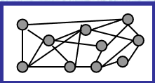

下面给出更加严谨的数学定义:

>***Definition*** 1
>**图** **Graph**
>
>$V$ 是一个非空的有限集, $E$ 是 $V$ 上的一个二元关系, 有序对 $(V, E)$ 被称为**有向图(Directed Graph)**. 如果将 $E$ 中的序偶看作是无序的(即将 $e=(a,b)$ 看成 $e=\{a,b\}$），则称 $(V, E)$ 为无向图**Undirected Graph**. **有向图**和**无向图**统称为图(**Graph**)，记为 $G$.

>***Definition*** 2
>**顶点**, 或者**结点** **Vertices**
>
>$V$ 中的元素用带标记的点表示, 称为**结点**.

>***Definition*** 3
>**边** **Edge**
>
>- **有向边(弧)** **Arc or Directed edge**
>  有向图 $G$ 之中, 如果 $e = (a,b) \in E$, $e$ 称为 $G$ 的有向边. 用由 $a$ 到 $b$ 带箭头的线连接$a,b$.
>- **无向边** **Undirected edge**
>  无向图 $G$ 之中, 如果 $e = \{a,b\} \in E$, $e$ 称为 $G$ 的无向边. $ab$ 之间直接用连线连结. 

### 图的分类 1

图可以进一步分类: 对于图 $G = (V,E)$​

>**Simple Graph**
>**简单图**
>
>A graph in which each edge connects two different vertices and where no two edges connect the same pair of vertices is called a **simple graph**.
>
>$\forall (a,b) \in E, a\neq b$, 并且**不存在重边**, 称其为简单图. 如下图. 
>
>注：但是允许 $(a,b),(b,a)$ 同时存在于 $E$.

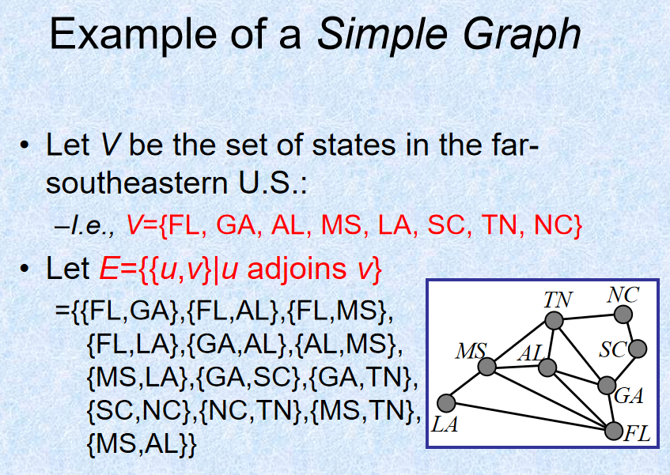

>**Multigraph** 
>**重图**
>
>允许 $E$​​ 是一个重集, 此时为重图, 相同的元素称为**重边(multiple edge)**.
>
>注: 这意味着**两个点之间允许有多条连线**.
>
>- Directed Multigraph **有向重图**
>
>Like directed graphs, but there are may be more than one **arc** between nodes.
>
>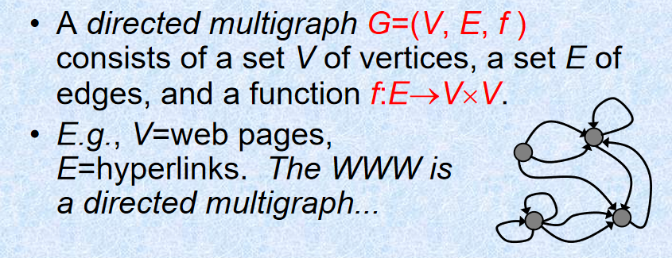

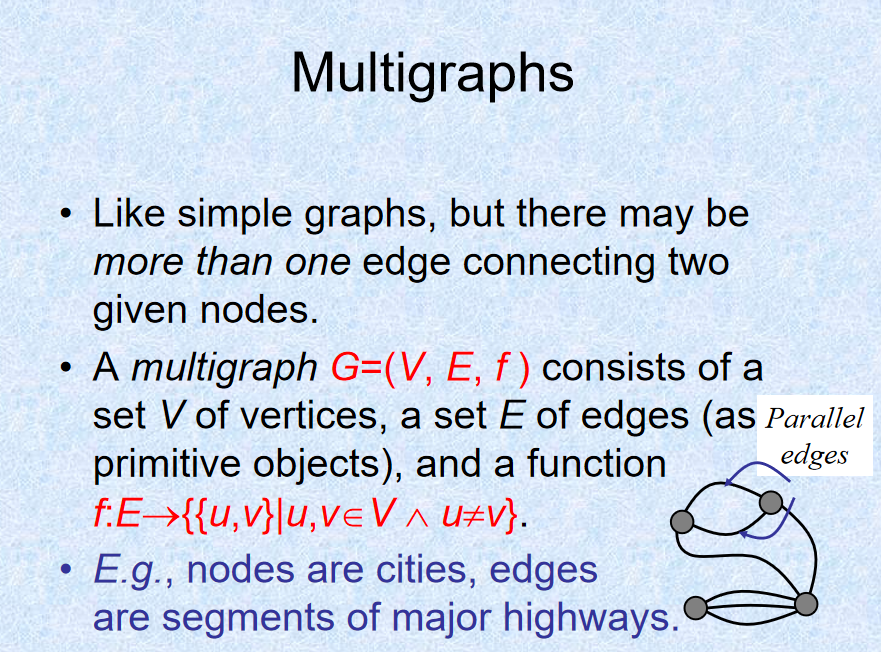

>**Pseudograh**
>**拟图**, 或**伪图**
>
>$G$​ 既允许是重图, 又允许是非简单图, 此时称为**拟图**.
>
>注: 在允许是重图的基础上, 允许存在两个端点是同一结点的边(即允许自环存在).
>
>- **loop 自回路/自环**
>  $(a,a) \in E$ 称为自环.

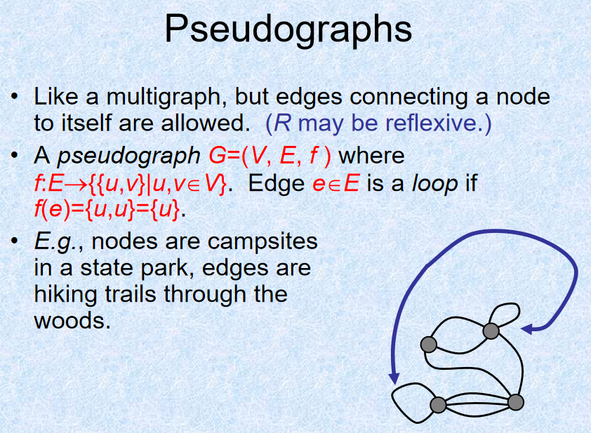

一般的 $G$ 称为**线型图**(**Linear Graph**). 我们做个小结:

|        Term         | Edge type | Multiple edges | Self loops |
| :-----------------: | :-------: | :------------: | :--------: |
|    Simple Graph     |  Undir.   |       No       |     No     |
|     Multigraph      |  Undir.   |      Yes       |     No     |
|     Pseudograh      |  Undir.   |      Yes       |    Yes     |
|   Directed Graph    | Directed  |       No       |    Yes     |
| Directed Multigraph | Directed  |      Yes       |    Yes     |

## 图的术语

***Graph Terminology***

>***Definition*** 4
>
>**Adjacency 邻接(相邻)**
>
>定义**无向图** $G=(V, E)$, $E$ 是边的集合. 设 $e \in E$ 等于(或者映射到)$\{u,v\}$, 那么有如下的描述:
>
>-  $u,v$ 是**邻接(adjacent/neighbours/connected)**的.
>-  边 $e$ **连接/关联(be incident with/connects)**了 $u$ 和 $v$​.
>-  $u,v$ 是 $e$​ 的**端点(endpoint)**.
>-  在有向图中, 有向边 $(u,v)$ 中, $u$ 称为**起点(initial vertex)**, $v$ 称为**终点(terminal or end vertex)**.

>***Definition*** 5
>
>**Degree of a Vertex 顶点的度(顶点的次)**
>
>定义**无向图** $G=(V, E)$, $v\in V$ 是一个 vertex. the degree of $v$, or $\mathrm{deg}(v)$, 指的是与 $v$ 连接的边数. 对于边 $(v,v)$, 它对顶点的度的贡献是 $2$.
>
>- $\mathrm{deg}(v)=0$, 称 $v$ 是**孤立点(isolated vertex)**.
>- $\mathrm{deg}(v)=1$, 称 $v$​ 是**悬挂点(pendant vertex)或者叶点(leaf vertex)**.
>- $2|\mathrm{deg}(v)$, 称 $v$​ 为**偶点(even vertex)**.
>- $2\nmid \mathrm{deg}(v)$, 称 $v$​ 为**奇点(odd vertex)**.
>
>而对于**有向图**, 以 $v$ 为终点的边的条数称为**入度(in-degree)**, 记为 $\mathrm{deg}^-(v)$. 类似定义**出度(out-degree)**, 记为 $\mathrm{deg}^+(v)$. 定义 $\mathrm{deg}(v) := \mathrm{deg}^-(v) + \mathrm{deg}^+(v)$.

>**Theorem**
>
>**图论基本定理**, 或**握手定理(Handshaking Theorem)**
>定义**无向图** $G=(V, E)$. 总是有
>$$
>\sum\limits_{v \in V}\mathrm{deg}(v)=2|E|
>$$
>
>- 推论: 对于无向图, 具有**奇数度的顶点必有偶数个**.
>
>对于**有向图**, 有:
>$$
>\sum\limits_{v \in V}\mathrm{deg}^+(v)=\sum\limits_{v \in V}\mathrm{deg}^-(v)=\frac{1}{2}\sum\limits_{v \in V}\mathrm{deg}(v)=|E|
>$$

### 图的分类 2

下面介绍一些需要掌握的图.

>**Complete Graph**
>**完全图**
>
>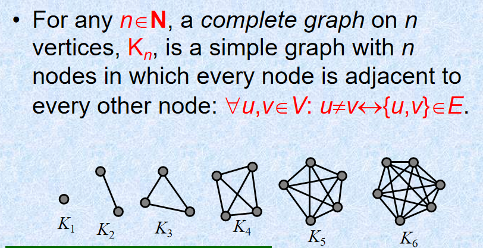
>
>这是一个不同的点总是相互连接的**简单图**. 跟据握手定理容易得到
>$$
>|E| = \frac{n(n-1)}{2}
>$$

>**Cycles**
>**环图**
>
>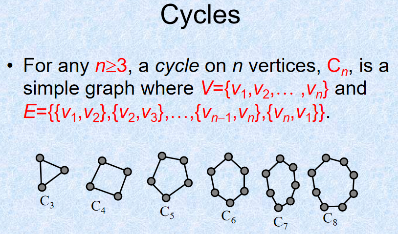
>$$
>|E| = n
>$$
>这是显然的.

>**Wheels**
>**轮图**
>
>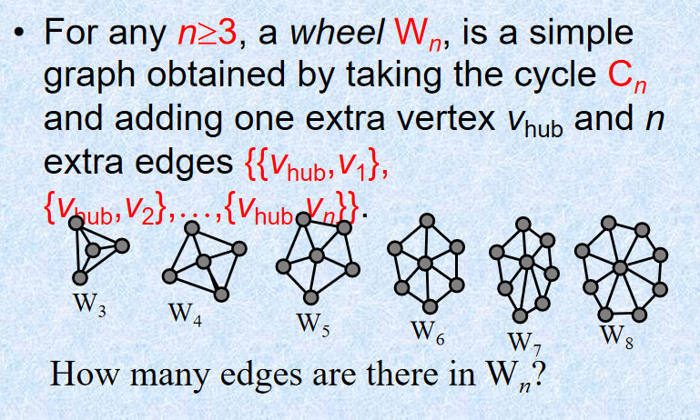
>
>其特征为存在一个**支配点(universal vertex)**, $\mathrm{d}(v) = |V|-1$, 这里出现了顶点的度的另一种写法, 此后不再说明.
>
>容易得到
>$$
>|E| = 2n
>$$
>注意此时的 $n$ 指的是"轮"的顶点数或者边数.

>**hypercubes($n$-cubes)**
>**超立方体**
>
>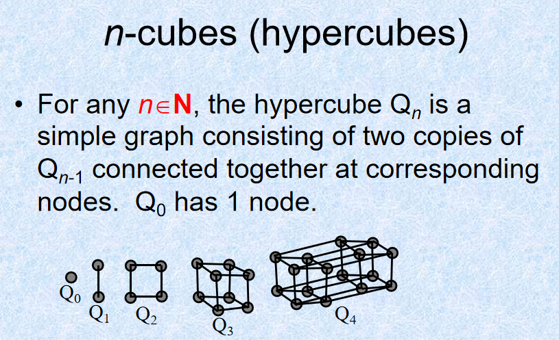
>
>易得
>$$
>|E| = n2^{n-1}
>$$
>过程是:
>容易发现有 $E_n = 2E_{n-1}+V_{n-1}$, 即 $E_n = 2E_{n-1}+2^{n-1}$. 所以 $\frac{E_n}{2^n}-\frac{E_{n-1}}{2^{n-1}}=\frac{1}{2}$. 所以跟据等差数列的知识
>$$
>|E_n|=n2^{n-1}
>$$
>注意此处 $n$ 是从 0 开始.

>**Bipartite Graph** 
>**二分图**
>
>**定义** $G=(V, E)$ 是二分图, 当且仅当 $V = V_1 \cup V_2$ 其中 $V_1 \cap V_2 = \empty$ 并且 $\forall e \in E,\exists v_1 \in V_1, v_2 \in V_2,e = \{v_1, v_2\}$(图上有误). 可以将这个定义拓展到重图和有向图.
>
>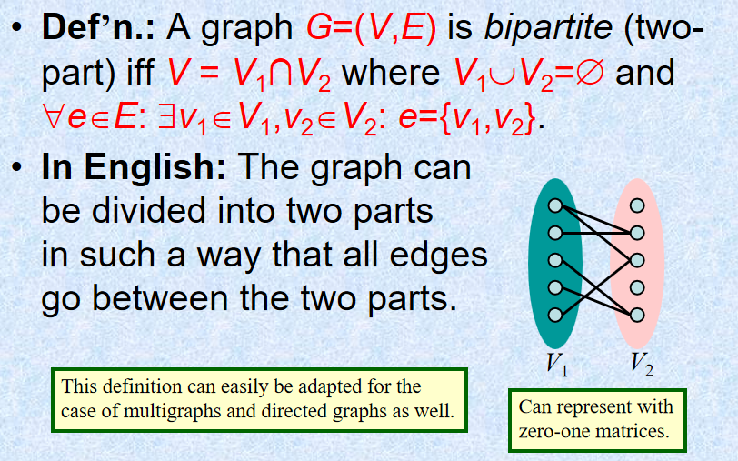
>
>- **Complete Bipartite Graph** **完全二分图**
>
>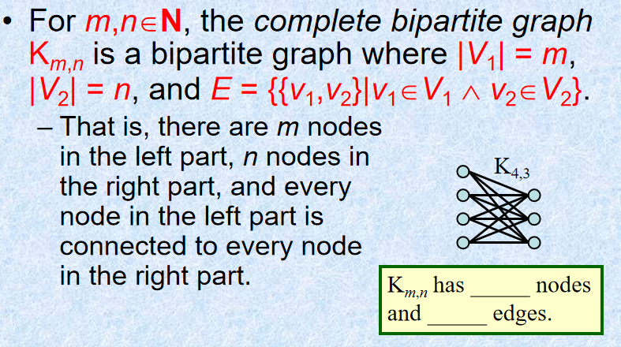
>
>

### 子图

接下来介绍子图.

>***Definition*** 6
>
>**Subgraph**
>**子图**
>
>$G=(V, E)$ 是图, $G'=(V', E')$ 被称为 $G$ 的子图, 如果
>
>- $V' \subseteq V$
>- $E' \subseteq E$
>
>注意, 当 $V' = V$, 称 $G'$ 是 $G$ 的**生成子图**.
>
>当 $E' \neq E$​ 或者 $V' \neq V$​ 时, 称 $G'$​ 为 $G$​ 的**真子图**.
>
>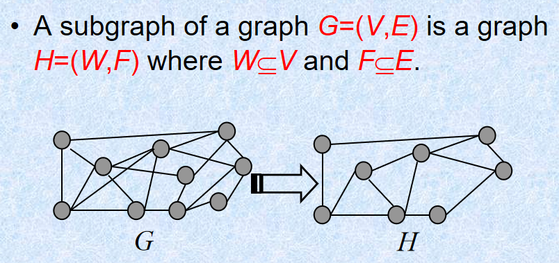

>***Definition*** 7
>
>**Graph Unions**
>**并图**
>
>定义两个简单无向图 $G=(V, E), G'=(V', E')$. 它们的并图 $G \cup G'$ 定义为 $G \cup G' = (V' \cup V, E' \cup E)$ 称为 $G$ 和 $G'$ 的并图.  
>
>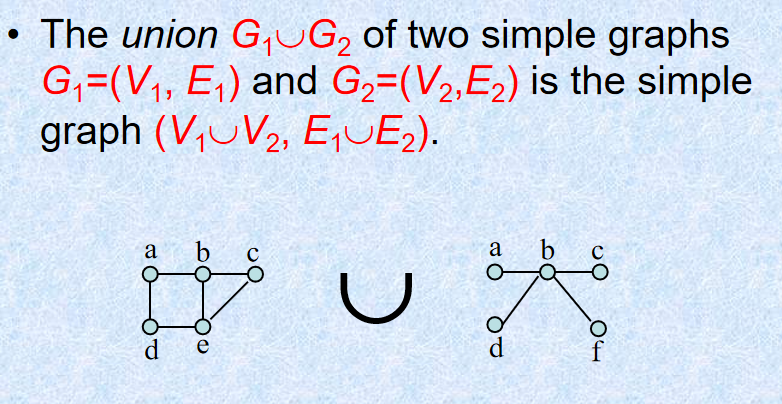

>***Definition*** 8
>
>**Complementary Graph**
>
>**补图**
>
>$G = (V,E)$ 是图, $G' = (V',E')$ 是 $G$ 的子图, $E'' = E - E',V''=V-V'$ 或者 $V''$ 是 $E''$ 中边所关联的所有顶点集合, 则 $G''=(V'',E'')$ 称为 $G'$ 关于 $G$​ 的**相对补图**.
>
>- 关于完全图的子图的补图称为此子图的**绝对补图**, 若子图记为 $G$, 则补图记为 $\overline{G}$.
>
>注意: 一般说的补图(包括所用教材[^1]), 均是指**简单图的绝对补图**, 并且与此处表示有差异的是:只删去边, 不删去点.

## 连通性

***Connectivity***

回忆我们在**关系**一章中学到的关于路径的概念.

>***Definition*** 9
>
>**Path** **道路/路径**
>
>我们说从**结点(vertex)** $a$ 到结点 $b$ 在图 $G(V,E)$ 有长度为 $n$ 的**路径**, 当且仅当存在 $n$ 个序偶$(a, x_1), (x_1,x_2),\dots,(x_{n-1},b) \in E$​, 这些邻边组成的的序列称为路径.
>
>路径也可以直接表示成:
>$$
>(a, x_1,x_2,\dots,x_{n-1},b) \in E
>$$
>共有 $n+1$ 个结点, 路径长度为 $n$​.
>
>对于起点终点一样, 长度不小于1的路径称为**回路(circuit or cycle)**

tips: 我们一般这样表述:"A path *traverses* the vertices along it". 一条路径*穿过*若干结点.

>***Definition*** 10
>
>**Simple Path 简单道路**
>
>没有重边的道路是**简单道路**. 若是回路, 则称为**简单回路(Simple circuit)**.

在关系一章中, 我们学到了内部顶点的定义.

>***Definition*** 11
>
>**基本道路 Element Path**
>
>一条路径不存在相同的内部顶点, 则称其为**基本道路**. 如果是回路, 则是**基本回路(Element Circuit)**.

tips: 回忆**内部顶点(interior vertex)**
一条路径中, 除开首尾的顶点是内部顶点. 起点和终点也可以作为内部顶点，如果起点被路径再次穿过，且起点不与终点重合，那么起点也是内部顶点. 同理如果终点被路径再次穿过, 且终点不与起点重合, 那么起点也是内部顶点.

>***Definition*** 12
>
>**连通性 Connectivity**
>
>图 $G(V,E)$ 中如果存在起点为 $v_0$, 终点为 $v_k$​​ 的道路, 我们称这两个点是**连通或可达(connective)**.
>
>- 无向图的连通
>  如果无向图 $G$ 中任意两个不同顶点都连通, 我们说这个**无向图**是**连通的**.
>
>- 有向图的连通
>
> - **弱连通(weakly connected)**:  **有向图** $G(V,E)$ 对应的无向图连通, 称 $G$ 为弱连通.
> - **强连通(strongly connected)**: 有向图 $G(V,E)$​ 任意两点都有路.
>
> 显然后者是前者的充分条件.

tips: 无向图中, $v_0$ ***到*** $v_t$ 连通 $\Leftrightarrow$ $v_t$ ***到*** $v_0$ 连通. 有向图未必.

>***Theorem*** 1
>
>任意连通无向图的任意两个顶点之间, 总存在一条**简单道路**.

>***Definition*** 13
>
>**Connected Components 连通分量(极大连通子图)**
>
>A connected component of a graph G is a connected subgraph of G that is not a proper subgraph of another connected subgraph of G. That is, a connected component of a graph G is a **maximal** connected subgraph of G. A graph G that is not connected has two or more connected components that are disjoint and have G as their union.
>
>图 $G$ 的一个连通的子图是图 $G$ 的连通分量, 如果它不是图 $G$ 的其它连通子图的子图.

tips: 换句话说, 我们可以这样进行等价定义: 考虑 $G$ 的连通子图和包含关系构成的偏序集合, $G$ 的连通子图是其中的极大元.

tips: 一个不连通的图 $G$ 含有至少两个互斥的连通分量, 他们的并为 $G$.

对于下一部分的内容, 常常讨论的是无向图, 对于有向图, 连通常常又指的是强连通.

>***Definition*** 14
>
>$\color{teal}{For \;this\; part, see}$ [图论相关概念 - OI Wiki](https://oi-wiki.org/graph/concept/#割).
>
>- **Cut Vertices**(or articulation points)
>  **割点**, **关节点**
>
> 对于连通图 $G=(V,E)$, 如果 $V' \subseteq V$ 并且 $G[V \backslash V']$ 不是连通的, 称 $V'$ 是图 $G$​ 的一个**点割集(vertex cut/separating set)**. 特别地, 基数为一点割集称为**割点(cut vertex)**.
>
> 等价定义: 对于一个无向图, 如果把一个点删除后这个图的极大连通分量数增加了(换句话说, 如果原来的无向图连通, 那么删除后原来的图不再连通), 那么这个点就是这个图的割点.
>
> 没有割点的图, 称为**不可分图(nonseparable graphs)**. 不难发现完全图是不可分的.
>
>- **Cut Edge**
>  **割边**
>
> 对于连通图 $G=(V,E)$, 如果 $E' \subseteq E$ 并且 $G(V,E \backslash E')$ 不是连通的, 称 $V'$ 是图 $G$​ 的一个**边割集(edge cut)**. 特别地, 基数为一边割集称为**割边(cut edge)或者桥(brige)**.
>
> 等价定义: 对于一个无向图, 如果删掉一条边后图中的连通分量数增加了(换句话说, 如果原来的无向图连通, 那么删除后原来的图不再连通), 则称这条边为桥或者割边.

>***Definition*** 15
>
>$\color{teal}{For \;this\; part, see}$ [图论相关概念 - OI Wiki](https://oi-wiki.org/graph/concept/#割).
>
>- Vertex connectivity 点连通度
>  对于非完全(noncomplete)图, 定义它的点连通度(Vertex connectivity)为
>
>$$
> \kappa (G)
>$$
>
> 含义为**最小点割集**的基数(非完全图).
>
>- Edge connectivity 边连通度
>
> 定义图 $G$ 的边连通度为
>$$
> \lambda (G)
>$$
> 含义为**最小边割集**的基数.
>
> 如果 $G$ 是非连通的, 或者只包含一个结点, 那么定义 $\lambda (G) = 0$.

## 图的表示法和同构

***Graph representations & Isomorphism***

>**Adjacency List**
>**邻接表**
>$$
>\begin{array}{c|l}
>Vertex & Adjacent \ \ Vertices	\\
>\hline
>a & b,c		\\
>b & a,c,e,f		\\
>c & a,b,f		\\
>d			\\
>e & b	\\
>f & c,b	\\
>\end{array}
>$$
>如图所示的**邻接表**可以表示如下的图.
>
>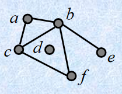
>
>对于**有向邻接表(Directed Adjacency Lists)**, 邻接表的第二栏是终点, 此处不再举例.

>**Adjacency Matrices**
>**邻接矩阵**
>
>$G = (V,E)$ 是简单图, 对于矩阵 $A = (a)_{ij}$, $a_{ij} = 1$ 当且仅当 $\{v_i,v_j\} \in E$, 否则 $a_{ij}=0$. 我们称这样的矩阵为邻接矩阵. 比如说:
>$$
>\begin{pmatrix}
>0 & 0 & 0 & 1	\\
>0 & 0 & 0 & 1   \\
>0 & 0 & 0 & 1   \\
>1 & 1 & 1 & 0
>\end{pmatrix}
>$$
>这个矩阵表示了:
>
>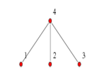
>
>- **有向图的邻接矩阵*
>  此时 $a_{ij}=1$ 说明的是 $v_i$ 到 $v_j$ 存在长度为 $1$ 的有向路径.

>**Incidence matrices**
>**关联矩阵**
>
>$G = (V,E)$ 是无向图, 设 $v_1,v_2,\dots,v_n$ 是所有顶点而 $e_1,e_2,\dots,e_m$ 是所有的边. $G$ 的关联矩阵定义为关系 $R$ 的关系矩阵, 其中 $R=\{(v_i,e_j)|\,\,e_j \mathrm{\; is \;incident \; with \;} v_i\} $.
>
>比如：
>
>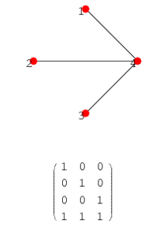

### 邻接矩阵和路径

此处着重说一下这两者的关系.

在adjacency matrix中, 如果 $a_{ij}=1$, 说明 $v_i$ 到 $v_j$ 可达, 若 $a_{ij}=0$ 并不说明 $v_i$ 到 $v_j$ 不可达. 如果通过其它点连通, 这是可能的. 对adjacency matrix进行一般的**矩阵乘法**运算来表示这样的中转(不妨想一想这是为什么, 解释是显然的). 一般地,

>**Theorem** 2
>
>设图 $G = (V,E)$, 其邻接矩阵为 $A = (a)_{ij}$, 且 $A$ 的整数次幂 $A^k = B = (b)_{ij},k \in N^+$.不论 $G$ 是否有向, $b_{ij}$(或者写成 $(A^k)_{i,j}$)等于 $v_i$ 到 $v_j$ 的长度为 $k$​ 的**道路的条数**.

定理2在**关系**这个章节中有类似的表述.

>**Theorem** 3
>
>设图 $G = (V,E)$, $|V|=n$, 如果不相同的顶点 $v_i$ 到 $v_t$ 有道路, 则最短的道路长度小于等于 $n-1$​​.

反证法易证.

>**Theorem** 4
>
>$\color{teal}{For \;this\; part, see}$ [【离散数学】图论 第七章(3) 图的矩阵表示（邻接矩阵、可达矩阵、传递闭包求解算法）-CSDN](https://blog.csdn.net/myRealization/article/details/121672837)
>
>设图 $G = (V,E)$, 其邻接矩阵为 $A$ ,$|V|=n$, 且
>$$
>B'=A+A^2 + \cdots + A^{n-1}
>$$
>如果不相同的顶点 $v_i$ 到 $v_j$ 可达, 那么 $b_{ij} \neq 0$​.
>
>- 若 $b_{ij} = 1$ 当且仅当 $v_i$ 到 $v_j$ 可达, 否则为 $0$. $B=(b)_{ij}$. 那么称 $B$ 为**可达性矩阵(Accessibility Matrix).** 不难证明 $B=  A \lor A^2 \lor  \cdots \lor  A^{n}$​​ , 并且有如下结论:
> - 无向图 $G$ 是连通图 iff 可达矩阵 $B$ 是全1矩阵.
> - 有向图 $G$ 是强连通的 iff 可达矩阵 $B$ 是全1矩阵.
> - 有向图 $G$ 是弱连通的 iff 以 $A\lor A^T$ 作为邻接矩阵, 求出的可达矩阵 $B'$ 是全1矩阵.

tips: 此处的 $\lor$ 指的是逻辑并运算, 含义为 " $v_i$ 到 $v_j$ 有长度为 $k$ 的道路..." **或** " $v_i$ 到 $v_j$ 有长度为 $k'$ 的道路..." **或** $\cdots$ 总之, 它表示 $v_i$ 到 $v_j$ 是否存在道路, 运算的结果从 $\{0,1\}$ 中取.

下面介绍**图的同构**.

### 图的同构

>***Definition*** 16
>
>**Graph Isomorphism**
>**图的同构**
>
>$G_1 = (V_1,E_1), G_2 = (V_2,E_2)$ 是**同构(isomorphic)**的, 当且仅当 $V_1,V_2$ 之间存在一个双射并且 $E_1,E_2$​ 之间存在一个双射.
>
>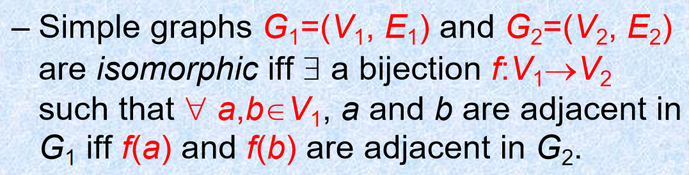
>
>可以借助邻接矩阵来判断同构, 对于两个图的邻接矩阵, 主要的做法如下:
>
>1. 根据图确定邻接矩阵.
>
>2. - 计算行次: 矩阵每行１的个数(对应了出度) 
>
> - 列次: 矩阵每列1的个数(对应于入度)
> - 不考虑次序, 首先确定矩阵的入度
>
>3. 先判断两个矩阵的行度和列度. 如果出现不同, 必不同构，否则继续
>4. 同时交换其中一个矩阵的 $i$ 行和 $j$ 行, $i$ 列和 $j$ 列. 如果能够变换为另一矩阵的样子, 那它们同构, 如不能, 则不同构.

## 欧拉路径, 哈密尔顿路径

***Euler and Hamilton Paths***

### 欧拉路径

***Euler Path***

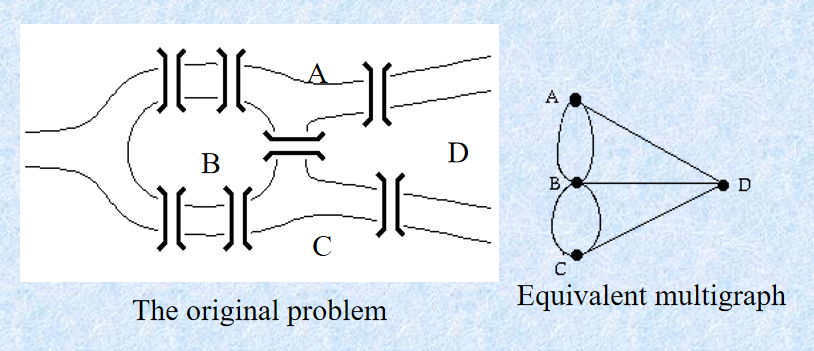

对于如图所示的七座桥, 能否不重复地一次性走过它们? 这个问题被称为七桥问题**(Königsberg bridge problem)**, 我们都知道, 它等价于能否一笔画右边的重图. 欧拉(Euler)在1736年给出了否定的答案. 跟据下文的知识我们知道这个图有 $4$ 个奇点, 既不存在欧拉路径, 也不存在欧拉回路.

>***Definition*** 17
>
>**Euler Path/Trail** 
>**欧拉道路**/E道路
>
>设图 $G = (V,E)$, 称包含 $E$ 中所有边(每条边仅使用一次)的**简单道路**为**欧拉道路**, 如果为回路, 则是**欧拉回路**(**Euler tour/circuit**).
>
>- 包含有欧拉回路(Euler tour)的图称为**欧拉图**(**Eulerian graph**)

我们有

>**Theorem** 
>
>**欧拉路径定理**
>
>- **(强)连通的**重图有一条欧拉回路 iff 该图每一个顶点都是偶点.
>- 连通的**无向重图**有一条欧拉路径(而不是欧拉回路) iff 该图**有且仅有(exactly two)**两个奇点, 并且它们一定是欧拉路径的起点与终点.

**\*分析**: 对于第一条, 充分性(->)是显然的. 必要性(<-)可以进行如下构造: 

设图 $E$. 

1. 记任意一点 $a$ 是起点, 一个点一个点地形成不含有重复边的道路. 最终形成 $a$ 到 $a$ 的回路. 设第一步形成图 $H_1$.  $E:=H_1$ 
   *由于边是有限的, 这样形成的道路总是会终止. 每个点都是偶点意味着每个点的出度等于入度, 这说明终点只能是 $a$ , 因为不难发现 $a$ 的入度等于出度当且仅当路径经过 $a$. 下面只需要说明这样的一条道路使用了所有的边.* 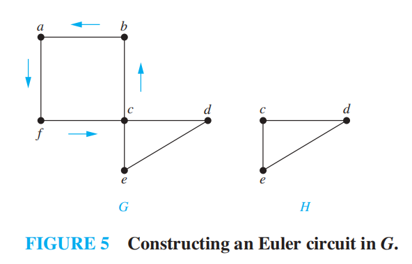

2. 假设还有一些边未被使用, 设它们以及它们的端点形成图 $H_2$, 不难证明 $H_2$ 每个点必为偶点. 重复上述操作, 并以 $H_1$ 和 $H_2$ 的一个公共点为起点. 由此形成新的回路. 且 $E:= E \cup H_2$

   *接下来我们说明一件事情:*

   - *$H_2$ 与 $H_1$ 有公共点.*

   *由于 $G$ 是连通的, 一个不在 $H_1$ 中的点, 它或者与 $H_1$ 中的一个点相连(此时 $H_1$ 的这个点也在 $H_2$ 中, 而它们形成的边不属于 $H_1$), 或者与另一个不在回路中的点相连. $H_2$ 中的点至少有一个点满足第一个"要么", 否则 $H_1$ 与 $H_2$ 的并是不连通的, 与 $G$ 的连通性矛盾. 综上所述, $H_2$ 至少和 $H_1$ 有一个公共点.*

3. 对 $H_2$ 产生的剩下的边, 记为图 $H_3$ 继续进行同样的操作.$E:= E \cup H_3,\cdots,E:= E \cup H_n$直到使用完所有边.

   *这个算法一定可以结束, 因为总边数只有有限条.*

4. 将每一步所得的回路并起来. 即 $E$ 是所求的欧拉回路. 实际操作时每一步将 $E$ 与 $H_k$ 的公共点替换为点序列 $H_k$​ 即可. 

---

对于定理的第二条(考虑无向图), 考虑任意两个奇点 $a,b$ , 如果它们之间加一条边, 一定可以形成 $a$ 到 $a$​ 的欧拉回路, 现在断开这条边, 显然就成了欧拉路径. 充分性(->)是显然的.

跟据上面的证明过程, 我们有如下定理

>Theorem(有向图的欧拉定理)
>
>**连通有向图** $G = (V,E)$​ 是欧拉图 iff 每个顶点的入度等于出度.
>
>**非平凡**有向图 $G$ 具有欧拉道路 iff
>
>- 弱连通
>- 具有一个入次 - 出次等于 1 的点和一个入次 - 出次等于 -1 的点, 并且其它点的入次等于出次.

定理第一条, 第二条的证明基本一致.

tips: **平凡图**(**trivial graph**)指的是一个孤立点(isolated)构成的图.

### 欧拉回路算法

***Euler Circuit Algorithm***

介绍构造欧拉回路的一种方法, 即**Fleury算法**, 俗称避桥法. 

$\color{teal}{For \;this\; part, see}$ [欧拉图 - OI Wiki](https://oi-wiki.org/graph/euler/)

核心思想为: **选择不是桥的边, 若没有, 选择桥. 然后将该边删去.** 下面是一个例子. 此处不再证明合理性.

### 哈密尔顿路径

***Hamilton Paths***

## 平面图

[^1]:Kenneth H. Rosen.Discrete Mathematics and Its Applications.离散数学及其应用.Eighth edition.
