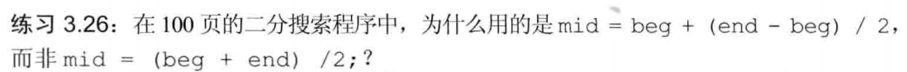
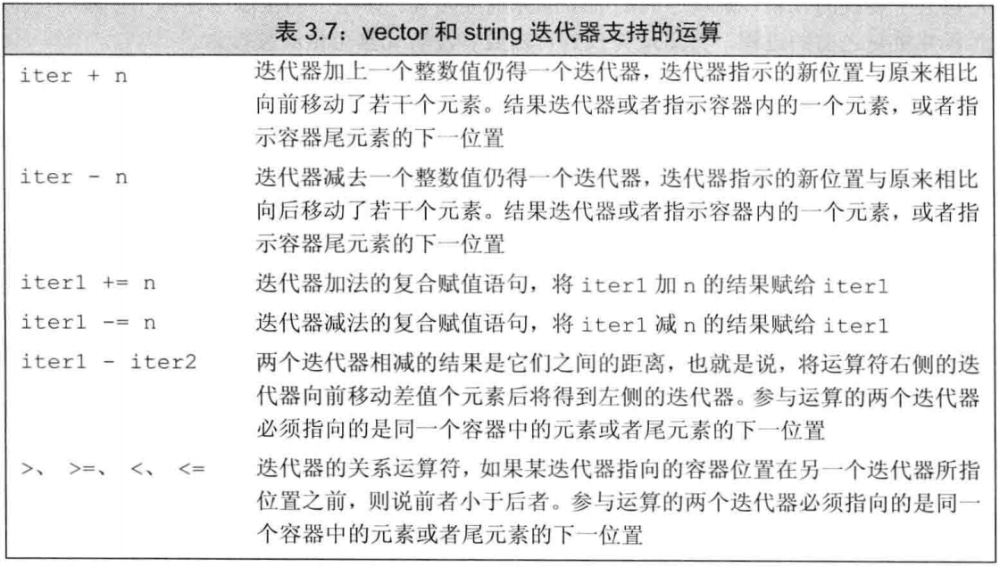

# 二分搜索算法简介

二分搜索算法的思想很简单

1. 对于有序的(比如说)一组数, 取定区间首尾(不包含尾), 取中间.

2. 如果中间的就是所需, 算法结束, 否则:

3. 如果所需比中间数小, 使区间尾等于中间数, 重复以上步骤.

   如果所需比中间数小, 使区间首等于中间数+1, 重复以上步骤.

在对区间进行二分的时候, 一般写成 ``beg + (beg-end) / 2`` 而不是 ``mid = (beg + end)/2``. 下面进行说明.

# 1. 迭代器的运算

在 *C++ primer,Fifth Edition* 中, 介绍迭代器一章时自然地引出了二分搜索算法, 形如:

```cpp
#include <iostream>
#include <string>
#include <vector>

using std::cin, std::cout, std::endl, std::vector;

int main(void)
{
    vector<int> text{1,2,3,4,5,6,7,8,9,10,11,12,13,14,15};
    int sought = 11;
    auto beg = text.begin(), end = text.end();
    auto mid = text.begin() + (end - beg) / 2;
    while (mid != end && *mid != sought) {
        cout << *mid << endl;
        if (sought < *mid)
            end = mid;
        else 
            beg = mid + 1;
        mid = beg + (end - beg) / 2;
    }
	cout << *mid << endl;
    
    return 0;
}
```

在本小节习题中有这样一个问题.

其实很简单. beg 和 end 都是 ``vector<int>::iterator`` 类型, 即迭代器类型. vector 迭代器的运算中并不包含两个迭代器的加法.

# 2. 数据溢出

如果 beg, end 和 mid 是不是迭代器, 而是int型来储存容器的下标, 仍然建议使用 ``beg + (beg-end)/2`` 而不是 ``mid= (beg + end)/2``.

原因很简单, 当容器下标过大的时候, ``(beg + end)`` 这一过程可能出现溢出(比如大于int范围, 就变为负数了).
