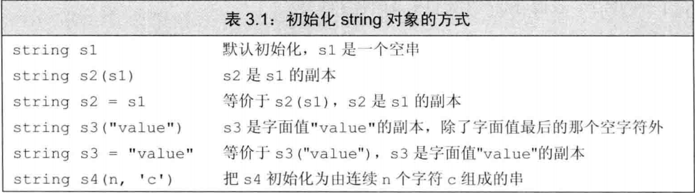
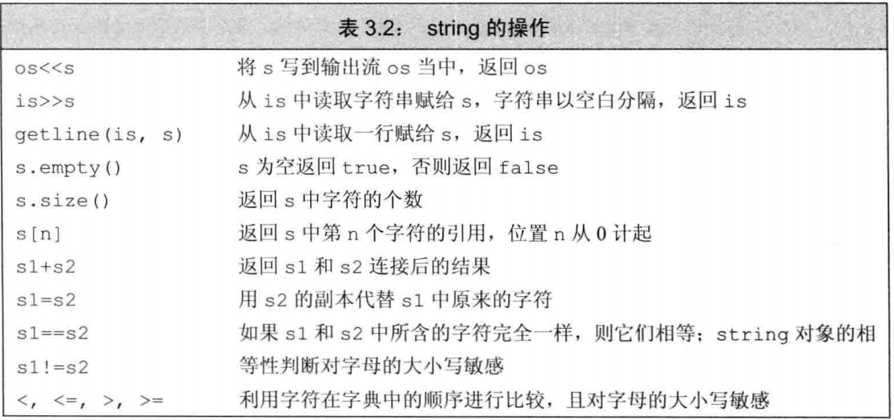
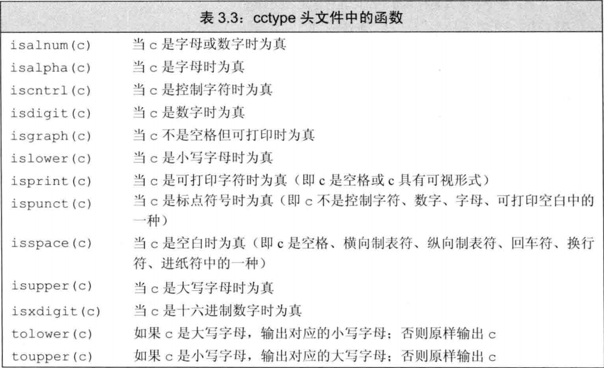
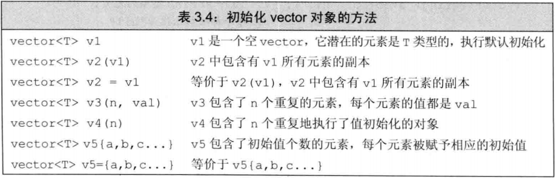
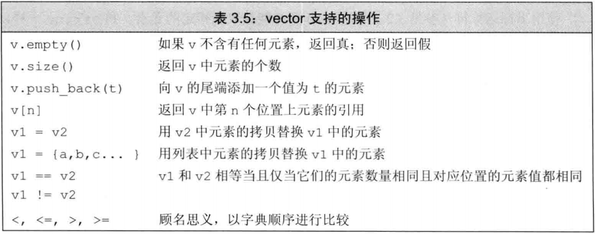
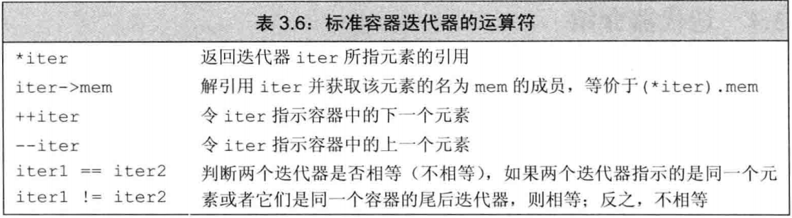
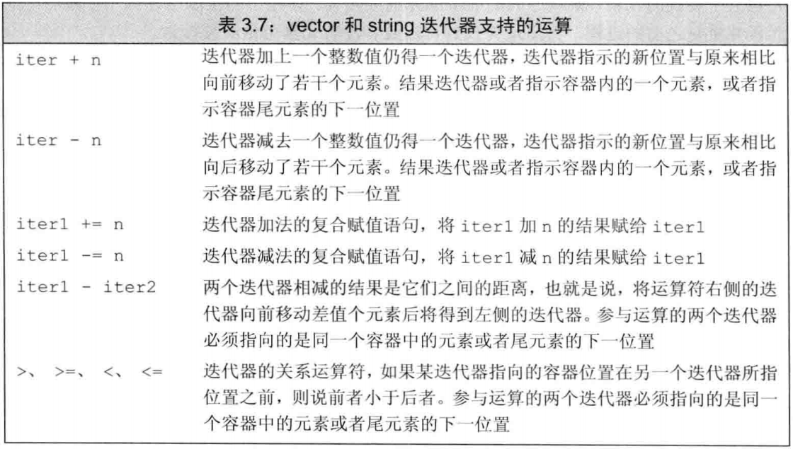

# 第2章 变量和基本类型

## 2.1 基本内置类型

包括算术类型(arithmetic type)和空类型(void). 前者包括整型(包括字符与布尔值)和浮点型.

### 2.1.2 类型转换(convert)

- 将非布尔类型的算术值赋值给布尔类型时, 初始值为 0 结果为 false, 否则结果都是 true.
- 将布尔值赋值给非布尔类型时, 初始值为 false 结果为 0. 初始值为 true 结果为 1.
- 把一个浮点数赋值给整数类型时进行近似处理, 结果仅保留浮点数中小数点以前的部分.
- 把一个整数值赋值给浮点类型的时候, 小数部分记为 0. 如果该整数所占的空间超过浮点类型的容量, 精度可能有损失.
- 赋给无符号类型一个超出其表示范围的值时, 结果是初始值对无符号类型表示数值总数取模后的余数. 例如, size 为 8 bit 大小的 unsigned char , 赋值为 -1, 所得的结果是 255.
- 赋值给一个带符号类型一个超出其表示范围的值时, 结果是未定义的.

### 2.1.3 字面值常量

- 指定字面值类型

  | 前缀 | 含义       | 类型     |
  | ---- | ---------- | -------- |
  | L    | 宽字符     | wchar_t  |
  | u8   | UTF-8      | char     |
  | u    | Unicode 16 | char16_t |
  | U    | Unicode 32 | char32_t |

  | 后缀     | 含义        |
  | -------- | ----------- |
  | U or u   | unsigned    |
  | l or L   | long        |
  | ll or LL | long long   |
  | f or F   | float       |
  | l or L   | long double |

## 2.2 变量

- 列表初始化(list initialization), 形如

  ```c++
  int units_sold = 0;
  int units_sold = {0};
  int units_sold{0};
  int units_sold(0);
  ```

  

  都是**列表初始化**.

- 默认初始化

  如果定义变量的时候没有指定初值, 则变量被**默认初始化**(default initialized). **内置类型**的变量未被显示初始化, 定义于任何函数体之外的变量被初始化为0. 定义在函数体内部的值**不被初始化**(uninitialized), 未被初始化的内置类型变量的值是**未定义的**.

  是否允许不经初始化就定义对象, 以及初始化对象的方式由每个类各自决定. 如果前者被允许, 它将决定对象的初始值.

  绝大多数类都支持无需显式初始化而定义对象.

### 2.2.2 变量声明与定义的关系

如果想要声明一个变量而非定义它, 就在前面加上关键字 extern, 并且不要显示地初始化它. 变量只能定义一次, 可被多次声明. 试图初始化由 extern 标记的变量将会引发错误.

```c++
extern int i;	// 声明而非定义 i
```

### 2.2.3 标识符

标识符(identifier)最好不要以下划线开头.

## 2.3 复合类型(compound type)

- **引用(reference)**即别名, 只是为一个已经存在的对象起另外的名字. 引用必须被初始化. 每个引用标识符用 & 开头.

```c++
int ival = 1024;
int &refVal = ival;
```

引用本身不是一个对象, 不能定义引用的引用. 引用不能绑定在字面值或者某个表达式的计算结果.

但是, 常量引用是可以绑定非常量的(参加下文的顶层 const). 

另外, 在初始化常量引用的时候, 允许用任意表达式作为初始值, 只要该表达式能转化成引用的类型即可. 但对一般的引用而言, 这是非法的行为.


### 2.3.2 指针

指针在块作用域定义时没有初始化, 将拥有不确定的值. **任何非0指针对应布尔值均是true**.

指针的值(地址)应属于以下4种状态:

- 指向一个对象
- 指向紧邻对象所占空间的下一位置. 访问它的后果是未定义的.
- 空指针, 即没有指向任何对象. 访问它的后果是未定义的.
- 无效指针, 即不属于上述情况. 访问它的后果是未定义的.

生成空指针可以:

```c++
int *p1 = nullptr;
int *p2 = 0;
// #include cstdlib
int *p3 = NULL;
```


但是不能直接把为0的int类型变量赋值给指针. 简易初始化所有的指针.


- void* 指针

  特殊的指针类型, 可以存放任意对象的地址.不能直接操作 void* 指针指向的对象, 因为我们并不知道这个对象到底什么类型, 也就无法确定这个对象上能做哪些操作.

### 2.3.3 理解复合类型的声明

```c++
int* p1, p2;
```


其含义是 p1 是指针, p2 是 int型的值.

引用不是一个对象, 定义指向引用的指针是错误的. 但是可以存在对指针的引用.

```c++
int i = 42;
int *p;
int *&r = p;

r = &i;	// 实际上改变了指针p的值
*r = 0;	// 解引用r实际上就是解引用p, 最终改变了i的值
```


## 2.4 const 限定符

const 必须初始化.

默认状态下, const 对象仅在定义过文件中有效, 原因是编译器将在编译过程中把用到该变量的地方都替换成对应的值.

如果在多文件程序中, 只想定义一次, 在多个文件中共享 const 对象. 做法是在const前添加extern关键字. 在声明和定义前都加上.

```c++
extern const int bufSize = 1024;
extern const int bufSize;
```


### 2.4.1 const 的引用

```c++
const int ci = 1024;
const int &r1 = ci;	// right
r1 = 42				// wrong
int &r2 = ci;		// wrong
```

#### 初始化和对 const 的引用


### 2.4.2 指针与 const

指针的类型必须与所指的对象一致, 但是**指向常量的指针**可以指向非常量对象，其含义是**不能通过该指针改变对象的值**, 但可以通过其它途径改变. 另外, 该指针也可以指向其它常量对象, 等于说具有相同的底层const 资格.

```c++
double dval = 3.14;
const double *cptr = &dval;	// right
```

同时也有**常量指针(const pointer)**, 形如

```c++
int errNumb = 0;
int *const curErr = &errNumb;
```

其含义是指针本身是一个常量, 不能改变其存储的地址. 但是指针指向的值是否能改变取决于那个值的类型本身.

### 2.4.3 顶层 const

用名词顶层 const(top-level const) 表示指针本身是一个常量, 而用名词底层 const(low-level const) 表示指针所指的对象是一个常量.

一般地, 顶层 const 表示任意的对象是常量, 底层 const 与复合类型的基本类型部分有关. 

指针既可以是顶层 const, 也可以是底层 const. 

顶层 const 遵循赋值的一般规则就可以了. 一旦赋值涉及到指针和引用, 就容易让人混乱, 遵循以下的规则可以避免出错.

```c++
int i = 0;		 	
int *const p1 = &i;  		// 不能改变 p1, 顶层 cosnt 
const int ci = 42	 		// 不能改变 ci, 顶层 const
const int *p2 = &ci; 		// 允许改变 p2, 不允许改变指向的值, 底层 const
const int *const p3 = p2;	// 同时是顶层 const 和底层 const
const int &r = ci;			// 底层 const

int *p = p3;				// wrong: p3包含底层const, p没有
p2 = p3;					// right: p2和p3都是底层const
p2 = &i;					// right: int*能够转换成const int*
int &r = ci;				// wrong: 普通的int&不能绑定在 int 常量上
const int &r2 = i;			// right: const int& 可以绑定在普通的 int 上
```

总结: 执行拷贝操作的时候, 拷入和拷出对象要么具有相同的底层 const 资格, 要么是将底层的非常量转化为常量, 反之则不行. 换言之, 底层 const 总是在赋值的左边.

### 2.4.4 constexpr 与常量表达式

常量表达式是指值不会改变并且在编译过程就能得到计算结果的表达式. 比如说字面值. 一般来说, 如果认定某个变量是常量表达式, 那么就把他声明为 constexpr.

## 2.5 处理类型

### 2.5.1 类型别名

传统方法是使用typedef

```c++
typedef double wages		// wages 是 double 的同义词
typedef wages base, *p;		// base 是 double 的同义词, p 是 double* 的同义词
```

C++11提供了别名声明的方法:

```c++
using SI = Sales_item;
```

#### 指针, 常量和类型别名

类型别名若是复合类型或常量, 把它用到声明语句中会产生意料之外的后果.

```c++
typedef char *pstring;
const pstring cstr = 0; // cstr is a constant pointer to char
const pstring *ps; // ps is a pointer to a constant pointer to char
```

此时并不能够将第2行理解成: cstr 是指向常量char的指针. const是对给定类型的修饰, 既然pstring是指向char类型的指针, 那么const pstring就是指向char类型的指针常量.

### 2.5.2 auto

auto会让编译器替我们分析表达式所属的类型. 一般来说 auto 会忽略掉顶层const, 保留底层const. 如果希望推断出的auto类型是顶层const, 需要手动指出:

```c++
const int ci = 0;
const auto f = ci;
```

auto只确定了基本的数据类型, 定义多个变量时, 要注意一致性.

```c++
int i = 0;
const int ci = 0;
auto &n = i, *p2 = &ci;		// 错误: i的类型是int, 但是ci的类型是const int
```


### 2.5.3 decltype 类型指示符(C++11)

如果 decltype 使用的表达式是一个变量, 则decltype 返回该变量的类型(保留顶层 const); 如果 decltype 使用的表达式不是一个变量, 则 decltype 返回结果对应的类型. decltype 的结果可以是一个引用类型.

```c++
const int ci = 0, &cj = ci;
decltype(ci) x = 0;		// x 的类型是 const int
decltype(cj) y = x;		// y 的类型是 const int&, 必须初始化
decltype(cj) z;			// 错误, z是一个引用, 必须初始化
```

如果表达式的内容是解引用操作, 得到引用类型. 如果是双层括号(这样编译器会认为这是一个表达式), 得到的结果永远是引用.

## 2.6 自定义数据结构

大致是C语言中的结构体, 故略过.

形如:

```c++
struct Sales_data { /* ... */ } accum, trans, *salesptr;
// equivalent, but better way to define these objects
struct Sales_data { /* ... */ };
Sales_data accum, trans, *salesptr;
```

### 预处理器概述

C++程序还会用到的预处理功能是**头文件保护符(header guard)**. #define 指令把一个名字设定为预处理变量, 另外两个指令则分别检查某个指定的预处理变量是否已经定义: #ifdef 当且仅当变量已经定义时为真, #ifndef 当且仅当变量未定义时为真. 一旦检查结果为真, 则执行后续操作直到遇到 #endif 指令为止.形如:

```c++
#ifndef SALES_DATA_H
#define SALES_DATA_H
#include <string>
struct Sales_data {
 std::string bookNo; unsigned units_sold = 0; double revenue = 0.0;
};
#endif
```

- 预处理变量无视作用域的规则.
- 习惯性加上保护符吧.

# 第3章 字符串、向量和数组

## 3.1 命名空间的 using 声明


## 3.2 标准库类型 string

### 3.2.1 定义和初始化 string 对象



特别注意, 默认初始化的时候, string s1 是**一个空串**. 

#### 直接初始化和拷贝初始化

若用等号(=)初始化一个变量实际执行的是拷贝初始化. 如果不用等号则是直接初始化.可以通过 

```cpp
string a = string(10,'c');
```

来显示地创建一个临时对象用于拷贝.

### 3.2.2 string对象上的操作



#### 读写 string 对象

string 对象会自动忽略开头的空白(即空格符, 换行符, 制表符等), 并从第一个真正的字符读起直到遇到下一处空白为止.

#### 读取未知数量的 string 对象

#### 使用 getline 读取整行

有时我们希望能够在最终得到的字符保留输入时的空白符, 这时应该用 getline 函数. getline 只要一遇到换行符就阶数读取操作并返回结果.

getline() 是一个函数, 参数是一个输入流和一个 string 对象.

getline也返回其流参数. getline 会读取换行符, 但是不会将那个换行符存储在 string 对象中.

#### string 的 empty 和 size 操作

#### string::size_type 类型

只要记住它是一个无符号整型数, 同时避免它与 int 类型进行比较.

#### 比较 string 对象

字典顺序. 使用关系运算符号.

#### 为 string 对象赋值

#### 两个 string 对象相加

#### 字面值和 string 对象相加

字面值和字面值的相加是不允许的. 由于历史原因, 也为了与 C 兼容, C++的字符串字面值不是标准库类型 string 的对象.

### 3.2.3 处理 string 对象中的字符




## 3.3 标准库类型 vector

使用 vector 前, 假定已经有

```cpp
#include <vector>
using std::vector;
```

在一些比较老的编译器中, 如果vector的元素还是vector, 外层 vector 的右尖括号需要添加空格.

```cpp
vectot<vector<int> >
```

### 3.3.1 定义和初始化 vector 对象



对于第一种默认初始化, 将会创建指定类型的空 vector.

C++11提供了列表初始化的办法. 形如

```cpp
#include <string>
using std::string;
vector<string> art = {"a", "an", "the"};
```

#### 列表初始值还是元素数量?

```cpp
vector<int> v1(10); // v1 has ten elements with value 0
vector<int> v2{10}; // v2 has one element with value 10
```

使用圆括号, 是**构造**对象, 则vector中有10个**值初始化**的对象; 使用花括号, 则是**列表初始化(list initialize)**, 列表中只有一个元素. 此处的语法比较灵活, 使用花括号的时候, 编译器会先尝试列表初始化. 若不能列表初始化, 编译器会尝试构造vector.

```cpp
vector<string> v1{10, "hi"};
/* 正确, 有十个值为"hi"的元素 */
vector<string> v2{10};
/* 正确, 有十个默认值的元素 */
```

### 3.3.2 向 vector 对象中添加元素

即利用 vector 的成员函数 **push_back**(x). 不赘述.

使用 push_back 的编程假定是循环正确无误. 如果循环体内部包含向 vector 对象添加元素的语句, 则不能使用范围 for 循环.

### 3.3.3 其它 vector 操作



size 的返回值类型是由 vector 定义的 size_type 无符号类型. 例如

```cpp
vecto<int>::size_type
```

## 3.4 迭代器介绍

### 3.4.1 使用迭代器

拥有迭代器的类型都拥有名为 **begin** 和 **end** 的成员, 现阶段理解为指针即可. end 成员返回的迭代器称为尾后（off-the-end iterator）迭代器, 它负责指向最后一个元素的后一位. 如果容器是空的, begin 和 end 返回同一个迭代器.

特别注意, 不允许解引用尾后迭代器.

#### 迭代器运算符

 

#### 迭代器的类型

拥有迭代器的标准库类型使用 **iterator** 和 **const_iterator** 来表示迭代器的类型. 形如

```cpp
vector<int>::iterator it;
// it 的类型是迭代器 vector<int>::iterator
```

**iterator** 可读可写. **const_iterator** 可读但是不可通过迭代器修改指向的元素(不能通过解引用修改).

如果对象是常量, begin 和 end 返回 const_iterator; 若不是, 则返回 iterator;

对于无需写操作的时候, 可以使用 cbegin 和 cend, 它们只返回 const_iterator 类型.

### 3.4.2 迭代器运算



迭代器相减所得的类型是 **difference_type** 是一个带符号的整形数, 可正可负. string 和 vector 都定义了 difference_type. 


## 3.5 数组

### 3.5.1 定义和初始化内置数组

数组的大小必须是常量表达式, 也可以留空, 编译器自行推测. 显示初始化时候, 没有提供的位置会被初始化成默认值. 对于字符数组, 可以用字符串字面值进行初始化.

```cpp
char a1 = "Cpp";
```

#### 不允许拷贝和赋值

不能用数组为其他数组赋值, 也不能把一个数组拷贝初始化另一个数组.

### 3.5.2 访问数组元素

## 3.6 多维数组
