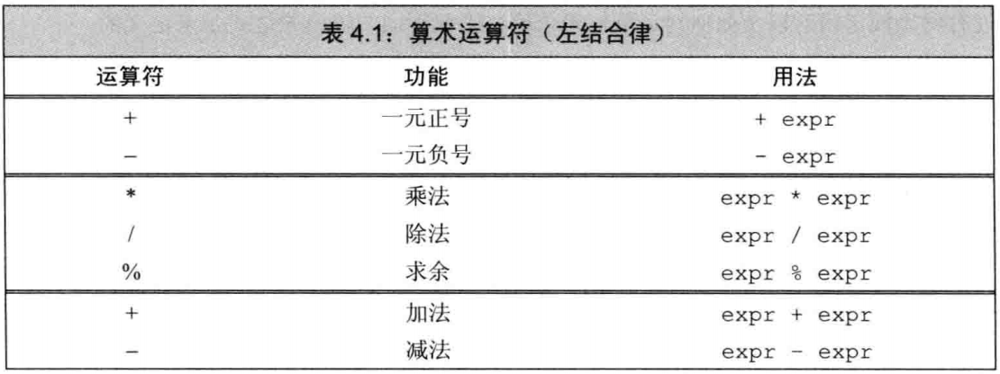
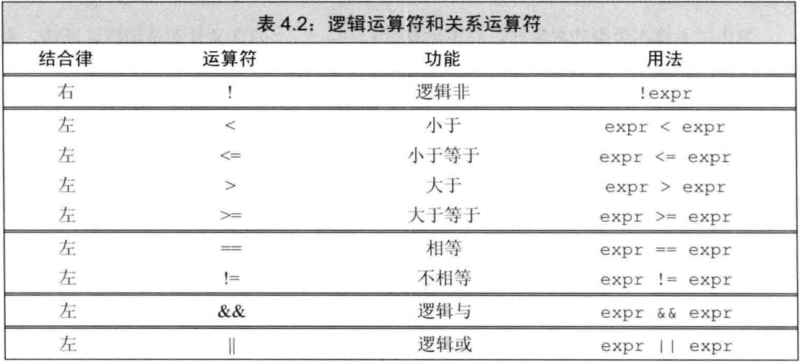
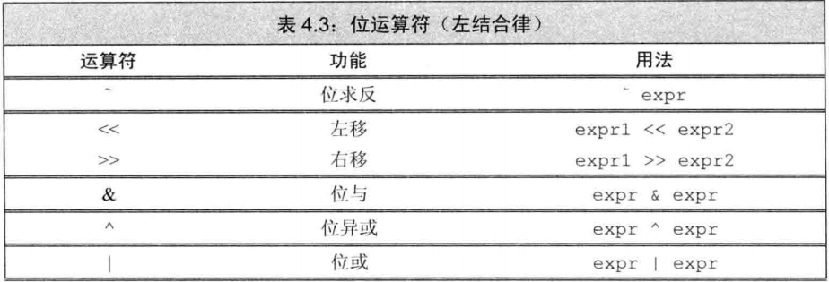
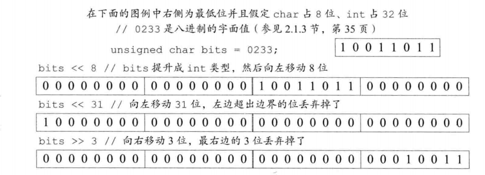
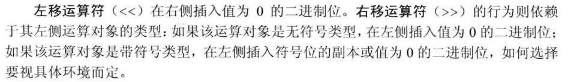
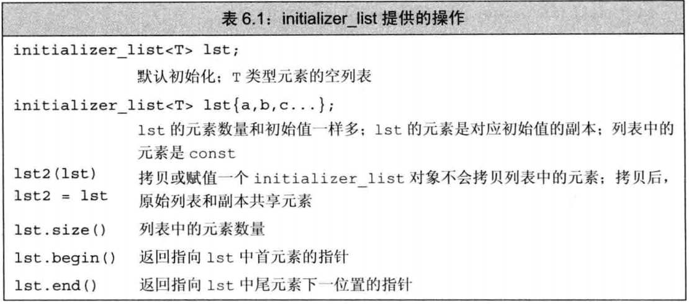

# 第4章 表达式

首先明确:

**表达式(expression)**是由一个或多个**运算对象(operand)**组成, 对表达式的求值将得到一个**结果(result)**. 字面值和变量是最简单的表达式, 其结果就是字面值和变量的值. 把一个运算符(operator)和一个或者多个运算对象组合起来可以生成较复杂的表达式.

以上的文字是理解之后概念的基础.

## 4.1 基础


### 4.1.1 基本概念

#### 左值和右值

C++的**表达式**要么是右值(rvalue), 要么是左值(lvalue). 该名称继承自C, 左值可以位于赋值语句的左侧, 右值则不能.

在C++中, 情况不是这样. 一个左值表达式的求值结果是一个对象或者一个函数, 然而以常量对象为代表的某些左值实际上不能作为赋值语句的左侧运算对象. 此外, 虽然某些表达式的求值结果是对象, 但它们是右值而不是左值.

当一个对象被用作**右值**的时候, 用的是**对象的值(内容)**; 对象被用作**左值**的时候, 用的是**对象的身份(在内存中的位置**). 一个重要的原则是在需要右值的地方可以用左值代替, 但是不能把右值当作左值使用. 一般来说, 我们说的右值在内存中没有位置(比如某个字面量).

- 赋值运算符的左侧运算对象是非常量左值, 得到的结果仍然是左值.
- 取地址符作用于一个左值运算对象, 返回一个指向该运算对象的指针, 该指针是一个右值(这个指针在内存中是没有位置的).
- 解引用运算符, 下标运算符, 迭代器解引用运算符, string 和 vector 的下标运算符的求值结果是左值.
- 内置类型和迭代器的递增递减运算符, 作用于左值运算对象, 其前置版本所得的结果也是左值.


当使用 ``decltype`` 的时候, 左值和右值有所不同. 如果表达式的求值结果是左值, 将会得到引用类型. 这也解释了第二章的例子中表达式若为解引用, 将得到引用.

比如假定 p 的类型是 `int*`, 因为解引用的运算符生成右值, 所以 `decltype(*p)` 的结果将会是 `int&`. On other hand, 因为 `&` 运算符生成右值, 故 `decltype(&p)` 的结果是 `int**`.

---

其后内容与C语言别无二致, 略看即可.

### 4.1.2 优先级与结合律

### 4.1.3 求值顺序

## 4.2 算术运算符



顾名思义, 算术运算符适用于任意算术类型以及任意能够转换为算术类型的类型. 其运算对象和求值结果都是**右值**.

>基本内置类型包括算术类型(arithmetic type)和空类型(void). 前者包括整型(包括字符与布尔值)和浮点型.

一元正号运算符是能够作用于指针的. 返回值是运算对象值得一个(提升后的副本).

对于求余运算 `m%n`, 符号与 m 相同. 实际上, (-m%n) = (-m)%n, 这样的运算避免了可能出现两个余数.

## 4.3 逻辑, 关系运算符

关系运算符作用于**算术类型**和**指针类型**, 逻辑运算符作用于任意能够转换为布尔值的类型. 逻辑运算符和关系运算符的返回值均为布尔类型. 值是0的运算对象为假, 否则均为真. 它们的运算对象, 求值结果都是**右值**.



#### 逻辑或, 逻辑与

这两个运算符都是先求左侧运算对象, 如果能够提前确定表达式的结果, 就不会计算右侧对象. 此称**为短路求值(short-circuit evaluation)**.

## 4.4 赋值运算符

赋值运算符的左侧必须是一个可修改的左值, 其结果为左侧的对象, 也是一个**左值**. 赋值运算满足右结合律. 优先级低于关系运算符.

## 4.5 递增, 递减运算符

>**建议**
>
>如非必须, 总是使用**前置版本**的递增递减运算符. 形如`++i`. 这是因为后置版本需要将原始值存储下来以便返回这个未修改的内容. 如果我们不需要之前的值, 这样的操作就是一种浪费.

另外, 递增递减运算符的优先级高于解引用. 因此 `cout << *pbeg++;` 等价于

```cpp
cout << *pbeg;
++pbeg;
```

提倡这样的写法, 体现了C++的简洁美.

## 4.6 成员访问运算符

包含点运算符和箭头运算符. 其中点运算符的优先级会高于解引用.`(*p).size()` 和 `*p.size()` 的含义截然不同.

箭头运算符作用于一个指针类的运算对象, 结果是一个左值. 点运算符分两种情况, 如果成员所属对象是左值, 那么是左值. 反之, 如果成员所属对象是右值, 那么结果是右值.

## 4.7 条件运算符(?:)

这是一个三元运算符. 一般形式是 `cond?expr1:expr2`, 如果cond为true, 执行expr1, 并返回该值; 若为false, 执行expr2, 并返回该值.

如果条件运算符的两个表达式都是**左值**, 或者能够转换为同一种左值类型的时候, 运算结果是左值, 否则是**右值**.

#### 嵌套条件运算符

>**建议**
>
>处于可读性, 嵌套最好不要超过三层.

## 4.8 位运算符

位运算符作用于**整型**和名为`bitset`的标准库类型.

如果运算对象是带符号的, 而且值为负, 那么位运算符如何处理运算对象的符号位完全依赖于机器, 并且, 此时的左移操作可能改变符号位的值. 换言之, 这是 undefined behaviour.

>**建议**
>
>强烈建议仅将位运算符用于处理无符号类型.

#### 算术移位

右侧运算对象一定不为负, 并且严格小于结果的位数, 否则是未定义的行为. 移出边界之外的位会被舍掉.



## 4.9 sizeof

满足右结合律. 一般有两种形式

```cpp
sizeof (type);
sizeof expr;
```

sizeof 并不计算 expr 其结果的值, 而是返回表达式结果的类型的大小.

考虑

```cpp
sizeof *p;
```

由于 sizeof 是右结合, 则以上等价于 `sizeof(*p)`,  哪怕p是无效(未初始化的指针), 也没有影响, 因为 sizeof 并不会计算表达式实际的值, 所以这条语句是安全的.

sizeof的返回值类型也是无符号整型 `size_t`. 若对char或者类型为char的表达式执行sizeof, 结果为1.

## 4.10 逗号运算符(comma operator)

逗号运算符含有两个运算对象, 按照从左到右的顺序依次求值. 最终丢弃掉左侧表达式的值, 真正结果是右侧表达式的值. 如果右侧运算对象是右值, 那么最终的求值结果也是左值.

## 4.11 类型转换

C++中, 某些类型之间有关联. 如果两种类型可以**相互转换(conversion)**, 那么它们就是关联的. 

#### 隐式转换(implicit conversion)

自动执行的转换, 无须程序员的接入, 有时甚至无需程序员的了解, 称为隐式转换. 

算术类型之间的隐式转换的设计原则是, 尽可能**避免损失精度**. 例如整型和浮点型混用, 会将整型转化为浮点型.

- 大多数表达式中, 比 int 小的类型会首先提升为较大的整数类型.
- 在条件中, 非布尔值会转换成布尔类型.
- **初始化**过程中, 初始值转换成变量的类型; 在**赋值**语句中, 右侧运算对象转换成左侧运算对象的类型.
- 如果算术运算或关系运算的运算对象有多种类型, 需要转换成同一种类型.

### 4.11.1 算术转换

**算术转换(arithmetic conversion)**的含义是把一种算术类型转换成另一种算术类型. 运算符的**运算对象将转换成最宽的类型**.

#### 整型提升(integral promotion)

负责把小整数类型转换成较大的整数类型. 比如 bool, char, signed char, unsigned char, short 和 unsigned short 会提升为 int 类型. 比如 false 提升为 0, true 提升为 1.

较大的char类型会提升为 int, unsigned int, long, unsigned long, long long 和 unsigned long long 最小的类型. 只要能够容纳.

#### 无符号类型的运算对象

如果两个提升后的运算对象要么都带符号, 要么都不带符号, 那么小类型的运算对象转化为大类型的.

如果一个运算对象是无符号的, 另一个是带符号的, 并且其中的无符号类型不小于带符号类型. 那么带符号的运算对象转换成无符号的. 如果带符号类型大于无符号类型, 此时的转换结果依赖于机器. 详细内容参见 *C++ primer(fifth edition)*, 这个内容不是非常重要.

### 4.11.2 其它的隐式类型转换

#### 数组转换为指针

对于用到数组的表达式中, 数组会自动转化为指向数组首元素的指针. 当数组被用作 `decltype` 的参数, 或者用于取地址符 `&`, `sizof` 和 `typeid` 等的运算对象时, 上述转换将不会发生.

#### 指针的转换

常量整数值 0 或者字面值 nullptr 可以转换成任意指针类型; 指向任意非常量的指针能转换成 `void*`; 指向任意对象的指针能转换成 `const void*`.

#### 转换为bool类型

如果指针或者算术类型的值是0, 转化为 false; 否则均转换为 true.

#### 转换为常量

允许将指向非常量类型的指针转换成指向相应的常量类型的指针, 对于引用也是如此. 参见之前的顶层const.

#### 类类型定义的转换


### 4.11.3 显式转换(强制类型转换 cast)

#### static_cast

任何具有明确定义的类型转换, 只要不包含底层 const, 都可以使用 static_cast. 例如, 通过将一个运算对象强制转换成 double 类型就能使表达式执行浮点数除法:

```cpp
double slope = static_cast<double>(j) / i;
```

当需要把一个较大的算术类型赋值给较小的类型的时候, static_cast 非常有用. 此时, 强制类型转换告诉程序的读者和编译器: 我们知道, 并且不在乎潜在的精度损失. 由此来避免编译器给出警告信息.

static_cast 也用于编译器无法自动执行的类型转换. 例如, 可以使用 static_cast 找回存在于 void* 指针中的值:

```cpp
void* p = &d;
double *dp = static_cast<double*>(p);
```

这样干的时候要确保转换所得的类型就是指针原来所指的类型, 否则将造成未定义的后果.

可以说, 总可以用 static_cast 将相应的隐式转换写出来.

#### const_cast

**仅仅**用于改变运算对象的**底层 const**.

```cpp
const char* pc;
char *p = const_cast<char*>(pc);
// right. 但是通过p去写值是undefined behaviour.
```

**只有** const_cast 可以修改表达式的常量属性, 使用其它形式的命名强制类型转换改变表达式的常量属性都会引发编译器错误.

**特别注意**, 通过 const_cast 去修改原有表达式的值是**未定义的行为**.

另外, 也不能用 const_cast 改变**表达式的类型**.

```cpp
const char *cp;
char *q = static_cast<char*>(cp);
/* 错误, 只有 const_cast 可以改变常量属性 */
static_cast<string>(cp);
// OK. 字符串字面值转换成 string
const_cast<string>(cp);
// Wrong. const_cast 只改变常量属性, 不能改变其类型.
```

#### reinterpret_cast

reinterpret 通常为运算对象的位模式提供较低层次上的重新诠释. 

它可以将指针强制转换为整型等, 而不使编译器报错. reinterpret_cast 在本质上依赖于机器. 想要安全地使用 reinterpret_cast 必须对设计的类型和编译器实现转换的过程非常了解.

>**建议: 避免强制类型转换**

#### 旧式的强制类型转换

早期的C++语言中, 显式的强制类型转换包含:

```cpp
type(expr);		// 函数形式
(type)expr;		// C风格
```

如果替换后不合法, 则执行与 reinterpret_cast 相似的行为.

## 4.12 运算符优先级


# 第5章 语句

## 5.1 简单语句

一个表达式(expression)末尾加上分号就成为了**表达式语句**(expression statement). 其作用为执行表达式并丢弃求值结果,

#### 空语句

#### 复合语句

用花括号括起来的语句和声明. 也称为**块(block)**. 一个块就是一个作用域.

## 5.2 语句作用域

## 5.3 条件语句

### 5.3.1 if语句

#### 悬垂 else(dangling else)

在C++中, 规定else与离他最近的if匹配, 消除程序的歧义.

### 5.3.2 switch 语句

#### switch 内部的变量定义

C++ 不允许跨过变量的初始化语句直接跳转到该变量作用域的另一个位置. 

## 5.4 迭代语句(循环)

### 5.4.1 while 语句

### 5.4.2 传统的 for 语句

注意若条件省略, 则总为ture.

### 5.4.3 范围 for 语句

C++11 引入了范围for语句， 语法形式是

```cpp
for (declaration : expression)
    statement;
```

expression 表示一个序列, 可以是花括号的初始值列表, vector, string 类型的对象. 它们的共同特点是拥有能返回迭代器的 begin 和 end 成员.

前面已经提到, range for 语句若对诸如多维数组的对象操作, 最外层应是引用.

### 5.4.4 do while 语句

记住最后有分号就行了.

## 5.5 跳转语句

### 5.5.1 break 语句

用来终止离他最近的 while, do while, for, switch 语句.

### 5.5.2 continue 语句

终止循环并立即进行下一次迭代. 对于range for 语句而言, 是用序列中的下一个元素初始化循环控制变量.

## 5.6 try 语句块和异常处理

这部分暂时用不到, 故略.

在C++语言中, 异常处理包括

- **throw 表达式(throw expression)**. 
- **try 语句块(try block)**.
- 一套**异常类(exception class)**.

### 5.6.1 throw 表达式

### 5.6.2 try 语句块

### 5.6.3 标准异常

# 第6章 函数

函数是一个有名字的代码块, 我们通过调用函数执行相应的代码. 函数可以有0个或多个参数, 而且(通常)会城市一个结果. 可以重载函数, 这也就是说, 同一个名字可以对应几个不同的函数.

## 6.1 函数基础

典型的函数(function)包含: 返回类型(return type), 函数名, 形参(parameter)组成的列表以及函数体. 其中形参以逗号隔开.

函数执行的操作在语句块中, 称为函数体(function body). 调用运算符的形式是圆括号, 它作用于一个表达式. 该表达式是函数或者指向函数的指针; 圆括号内是实参(argument)列表.

#### 调用函数

调用函数进行两项工作:

- 用实参初始化形参
- 将控制器转移给被调参数

此时, 主调参数的执行被中断, 被调函数开始执行.

### 6.1.1 局部对象

在C++中, 名字有**作用域**, 对象有**生命周期(lifetime)**.

形参和定义在函数体内部的变量统称为局部变量. 局部变量会隐藏在外层作用域同名的其它所有声明中.

#### 自动对象

对于C语言来说, 它对应关键词auto, 这在C++中不再一样. 对于局部变量对应的自动对象而言, 分为两种情况. 如果变量定义本身含有初始值, 则用这个初始值进行初始化; 否则, 如果变量定义本身不含初始值, 则执行默认初始化. 这意味着内置类型的**未初始化局部变量会产生未定义的值**.

#### 局部静态对象

知道程序终止才被销毁, 关键字 static.

### 6.1.2 函数声明

如果一个函数永远也无法被用到， 那么它可以只有声明没有定义。 函数声明也称作函数原型（function prototype）.

#### 在头文件中进行函数声明

### 6.1.3 分离式编译

## 6.2 传递参数

当形参是引用类型时, 我们说它对应的实参被**引用传递(passed by reference)**或者函数被**传引用调用(called by reference).**

当实参的值被拷贝给形参时, 形参和实参是两个相互独立的对象, 我们说这样的实参被**值传递(passed by value)**或者函数被**传值调用(called by value)**.

### 6.2.1 传值参数

>**建议**
>
>C程序员常常使用指针类型的形参访问函数外部的对象. 在C++语言中, 建议使用引用类型的形参去代替指针.

### 6.2.2 传引用参数

如果函数无需改变引用形参的值, 最好使用常量引用.

### 6.2.3 const 形参和实参

和其他初始化过程一样, 使用实参初始化形参的时候会忽略掉顶层 const. 换言之, 形参的顶层 const 被忽略掉. 当形参有顶层 cosnt 的时候, 传给它常量对象或者非常量对象都是可以的:

```cpp
void fcn(const int i) {/* fcn 可以读取 i, 但是不能向 i 写值.*/}
```

在C++中, 允许定义若干具有相同名字的函数, 不过前提是形参列表具有明显区别.

```cpp
void fcn(const int i){/*...*/};
void fcn(int i){/*...*/};
```

前面以及提到顶层const会被忽略掉, 因此, 这两个定义是重复的, 第二个定义会发生错误.

#### 指针或引用形参与const

形参的初始化与变量的初始化一样. 可以使用非常量初始化一个底层 const, 反过来就不行.

### 6.2.4 数组形参

```cpp
void print(const int*);
void print(const int[]);
void print(const int[10]);
```

三个等价声明. 下面是三种管理数组的办法:

#### 使用结束标记

#### 使用标准库规范 

#### 显式传递一个表示数组大小的形参

接下来

#### 数组形参和 const

前面的例子中把数组形参定义为指向 const 的指针. 如果要执行修改, 才定义为指向非常量的指针.

#### 数组引用形参

Cpp允许把变量定义为数组的引用. 熟悉这样的用法:

```cpp
void print(int (&arr)[10])
{
    for (auto elem : arr)
        cout << elem << endl;
}
```

此时, 相当于形参绑定到对应的实参. 实参应是 int 类型的数组. 注意要给&arr加括号.

### 6.2.5 main: 处理命令行选项

### 6.2.6 含有可变形参的参数

#### initializer_list 形参

如果函数的实参数量未知但是全部实参的类型相同, 我们可以使用 initializer_list 类型的形参. initializer_list 是一种标准库类型, 用于表示某种特定类型的值的数组.

initializer_list 对象中的元素**永远是常量**.

#### 省略符形参

省略符形参便于C++程序访问某些特殊的C代码. 这些代码使用了 varargs 的C标准库.

## 6.3 返回类型和 return 语句

#### 值是如何返回的

返回值的方式与初始化一样: 返回的值用于(拷贝)初始化调用点的一个临时量, 该临时量就是函数调用的结果.

如果返回的是引用类型, 则不会进行拷贝.

#### 不要返回局部对象的引用或者指针

```cpp
// 严重的错误
const string &manip()
{
    string ret;
    if (!ret.empty())
        return ret;
    else
        return "Empty";
}
```

两个 return 都会返回未定义值. 对第一条来说, 它返回局部变量的引用.

对第二条说, 字符串字面值会首先初始化调用点临时量(string类型引用), 函数完毕后, 内存被释放. 这个临时量的引用无意义.

#### 返回类类型的函数和调用运算符

调用运算符的优先级与点运算符和箭头运算符相同. 并且符号左结合律， 比如

`auto sz = shortString(s1, s2).size();` 其结果是先由shortString函数返回string对象, 再调用size().

#### 引用返回左值

调用一个返回**引用**的函数得到左值, 其他类型返回右值. 这也就是说, 我们可以能为返回类型是非常量引用的函数的结果赋值.

#### 列表初始化返回值

C++11规定, 函数可以返回花括号包围的值的列表. 表示对函数返回的临时量进行初始化. 如果列表为空, 临时量执行值初始化, 否则, 返回的值由函数的返回类型决定. 如果函数返回内置类型, 花括号包围的列表最多包含一个值.

#### 主函数main的返回值

`cstdlib` 头文件定义了两个预处理变量表示成功和失败, 分别是 EXIT_FAILURE 和 EXIT_SUCCESS.

#### 递归

### 6.3.3 返回数组指针

```cpp
typedef int arrT[10]; // arrT is a synonym for the type array of ten ints
using arrtT = int[10]; // equivalent declaration of arrT; see § 2.5.1 (p. 68)
arrT* func(int i); // func returns a pointer to an array of five ints
```

函数可以返回数组的指针或者引用. 可以通过如上类型别名的方法实现.

#### 声明返回数组指针的函数

回忆指向数组的指针的声明:

```cpp
int arr[10];
int *p1[10];
int (*p2)[10] = &arr
```

返回数组指针的函数形式如下:

`Type(*function(parameter_list))[dimension]`

比如:

`int (*fun(int i))[10];`

#### 使用尾置返回类型

C++11中, 可以使用尾置返回类型(trailing return type). 任何函数的定义均可以尾置返回.

```cpp
auto func(int i) -> int(*)[10];
```


#### 使用 decltype()

如果我们知道函数返回的指针指向哪一个数组, 就可以使用 `decltype` 关键字去声明返回类型.

```cpp
int odd[] = {1, 2, 3, 4};
int even[] =  {0, 2, 4};
decltype(odd) *arrPtr(int i)
{
    return (i % 2) ? &odd : &even;
}
```


## 6.4 函数重载

main 函数不允许重载

对于重载函数来说, 它们应该在**形参的数量**或者**形参类型**上有所不同. 

不允许两个函数除了返回类型之外其他所有要素都相同. 假设有两个函数, 它们的形参列表一样发但是返回类型不同.

```cpp
Record lookup(const Account&);
bool lookup(const Account&);
// 不允许
```

#### 判断两个形参的类型是否是相异的

- 形参的名字是否相同无关紧要
- 不能是别名

#### 重载和 const 形参

一个拥有顶层 const 的形参无法与另一个没有顶层cosnt的形参区分开. 前面已经提过, 顶层 const 将被省略.

#### const_cast 与重载

在第4.11.3节中提到过, `const_cast` 在重载函数的情景中最有用. 举个例子, 回忆 `shorterString` 函数:

```cpp
string &shorterString(string &s1, string &s2)
{
    auto &r =  shorterString(const_cast<const string&>(s1),
                             const_cast<const string&>(s2));
    return const_cast<string&>(r);
}
```

 返回的引用绑定在乐某某个初始的非常量实参上面. 因此, 我们可以将其再转换回一个普通的 string&.

#### 调用重载的函数

**函数匹配(function matching)**是一个过程, 这个过程中我们把函数调用与一组重载函数中的某一个关联起来, 函数匹配也叫重载确定(overload resolution). 调用重载函数可能有三种结果:

- 最佳匹配(best match)
- 无匹配(no match)
- 二义性调用(ambiguous call)

### 6.4.1 重载与作用域

>**建议**
>
>一般而言, 将函数声明置于局部作用域不是明智之举.

在C++中, 名字的查找发生在类型的检查之前. *C++ primer(fifth edition)* 上关于这一章讲得比较浅. 

## 6.5 特殊用途语言特性

### 6.5.1 默认实参

#### 使用默认实参调用参数

想要使用**默认实参(default argument)**, 只需在调用函数的时候省略实参.

```cpp
typedef string::size_type sz;
string screen(sz ht = 24, sz wid = 80, char backgrnd = ' ');
// 写成 string screen(sz = 24, sz = 80, char = ' '); 也成

string window;
window = screen(); // equivalent to screen(24,80,' ')
window = screen(66);// equivalent to screen(66,80,' ')
window = screen(66, 256); // screen(66,256,' ')
window = screen(66, 256, '#'); // screen(66,256,'#')
```

并且注意, **只能省略尾部的实参**.

设计函数的时候要让经常使用默认值的形参出现在后面. 而让不怎么使用默认值的函数出现在后面.

#### 默认实参声明

在给定的作用域中, 可以多次**声明**一个函数. 但一个形参只能被赋予一次默认实参, 换句话说, 函数的后续声明只能给没有默认值的形参添加默认实参, 并且该形参右侧的所有形参都要有默认值.

#### 默认实参初始值

**局部变量不能作为默认实参**. 除此之外, 只要表达式的类型能够转换成形参所需的类型, 都可以作为默认实参. 

用作默认实参的名字在函数声明所在的作用域内被解析, 而这些名字的求值过程发生在函数调用的时候.

```cpp
sz wd = 80;
char def = ' ';
sz ht();
string screen(sz = ht(), sz = wd, char = def);
string window = screen();
void f2()
{
 def = '*'; // 默认实参的值被确确实实的改变了
 sz wd = 100; // 此wd非彼wd, 函数作用域内的wd隐藏乐外层的, 但是外层的未被改变.
 window = screen(); // calls screen(ht(), 80, '*')
}
```

wd用于隐藏外层的wd, 但是


### 6.5.2 内联函数和 constexpr 函数

#### 内联函数避免函数调用的开销

一般来说, 调用函数一般比求等价表达式慢. 指定函数为内联函数(inline), 可以直接将它在某个调用点上展开, 节省运行的开销.

秩序在函数的返回类型前加上关键字 inline.

>内联说明只是向编译器发出的一个请求, 编译器可以忽略它.

#### constexpr 函数

前面以及提到过, 它指的是用于常量表达式(const expression, 指的是值不会改变, 且在编译过程就能得到计算结果的表达式)的函数.

在函数返回类型前加入 constexpr 关键词即可, 但是这样的函数必须:

- 返回类型以及所有形参都是字面值类型
- 函数体中有且仅有一条 return 语句.

执行初始化的时候, 编译器把 constexpr 函数的调用替换为其结果值. 为了能在编译过程中随时展开, constexpr 韩式被隐式地指定为内联函数.

constexpr 函数运行包含空语句, 类型别名, using语句等不执行任何操作的语句. 同时也允许 constexpr 函数能够返回非常量. 但是实际允许的时候应该让其返回常量, 否则编译器报错.

#### 内联函数和 constexpr 函数放在头文件内

不同于其他函数, 两种函数都可以被多次定义. 但是对于给定的内联函数和 constexpr 函数而言, 多种定义必须完全一致.

### 6.5.3 调试帮助

#### assert 预处理宏(preprocessor marco)

形如`assert(expr)`

首先对 expr 求值, 如果表达式为假(即0), assert 输出信息并且终止程序的执行. 如果表达式为真(非0), assert 什么也不做.

assert 定义在 cassert 头文件. 预处理名字由预处理器而非编译器管理, 因此我们可以直接使用预处理名字而无需提供using声明. 换言之, 直接使用 assert 而非 std::assert.

含有 cassert 头文件的程序不能再定义名为 assert 的变量, 函数或者其他实体. 即使没有包含 cassert 头文件, 也最好不要使用 assert 这个名字. 因为很多头文件都会包含 cassert.

#### NDEBUG 预处理变量

`__func__` 存放函数的名字, 是 const char 的一个静态数组

`__FILE__` 存放当前文件名的字符串字面值

`__LINE__` 存放当前行号的整型字体值

`__TIME__` 存放文件编译时间的字符串字面值

`__DATE__` 存放文件编译日期的字符串字面值

## 6.6 函数匹配

大多数情况下, 容易确定选用哪个重载函数. 当重载函数的形参数量相等, 形参类型可以由其他类型转换得到的时候, 这就不太容易了.

#### 确定候选函数和可行函数

集合中的函数称为**候选函数(candidate function)**. 它具有两个特征:

- 与被调函数同名
- 声明在调用点可见

考察本次调用的实参, 随后从候选函数中选出能被这组实参调用的函数. 这些函数称为可行函数**(viable function)**. 也有两个特征:

- 形参数量等于调用提供的实参数列.
- 每个实参类型与对应的实参相同或者可以转换.

如果没找到可行函数, 编译器将报错

#### 寻找最佳匹配(如果有的话)

基本思想是, 实参类型与形参类型越接近, 它们匹配的越好.

#### 含有多个形参的函数匹配

如果有且只有一个函数满足下列条件, 则匹配成功:

- 该函数每个实参的匹配都不劣于其他可行函数需要的匹配
- 至少有一个实参的匹配优于其他可行函数的匹配

如果在检查了所有实参之后没有任何一个函数脱颖而出, 则该调用错误,, 编译器将报告二义性调用的信息.

>调用重载函数时应该尽量避免强制类型转换.

### 6.6.1 实参类型转换

为了确定最佳匹配, 编译器将实参类型到形参类型的转换划分为几个等级, 具体的排序如下:

1. 精确匹配, 包括以下情况:
   - 实参类型和形参类型相同
   - 实参从数组类型或函数类型转换为对应的指针类型
   - 向实参添加顶层 const 或者从实参中删除顶层 const(形参的顶层 const 可以忽略).
2. 通过 const 转换实现的匹配(底层 const 的转化)
3. 通过类型提升实现的匹配
4. 通过算术类型转换或者指针转换实现的匹配
5. 通过类类型转换实现的匹配

## 6.7 函数指针

函数指针指向的是函数而非对象. 和其他指针一样, 函数指针只想某种特定的类型. 函数的类型由其返回类型和形参类型共同决定. 与函数名没有关系.

```cpp
bool (*ptr)(const string &, const string &);
// 声明一个该类型的函数指针
```

#### 使用函数指针

当我们把函数名作为一个值去使用的时候, 该函数自动地转换成指针. 使用函式的指针时无须提前解引用指针.

```cpp
pf = lengthCompare;
pf = &lengthCompare;//等价形式

bool b1 = pf("hello", "goodbye");	 // 调用函数
bool b2 = (*pf)("hello", "goodbye"); // 等价的形式
```

指向不同函数类型的指针不存在转换的规则. 但是可以让指针赋值为nullptr或者值为0的常量表达式, 一次表示指针不指向任何函数.

#### 重载函数的指针

使用重载函数的时候, 上下文必须清晰界定到底选用谁. 换言之, 指针必须与某个viable function **精确匹配**.

#### 函数指针形参

虽然不能定义函数类型的形参, 但是形参可以是指向函数的指针.

```cpp
void useBigger(const string &s1, const string &s2
              bool ptr(const string &, const string &));
// 等价声明
void useBigger(const string &s1, const string &s2
              bool (*ptr)(const string &, const string &));
```

可以直接把函数作为实参使用, 这时候会自动转换成指针.

直接使用指针类型会变得冗长, 可以考虑类型别名和decltype.

```cpp
typedef bool Func(const string &, const string &));
// Func 是函数类型
typedef decltype(lengthCompare) Func2;	// 等价的类型

// FunP 和 FuncP2 是指向函数的指针这一类型
typedef bool(*FuncP)(const string&, const string&);
typedef decltype(lengthCompare) *FuncP2; // 等价的类型
```

需要注意的是, decltyoe 返回函数类型而不是函数指针.

#### 返回指向函数的指针

和数组一样, 不允许返回一个函数, 但是允许返回函数的指针. 可以使用别名来声明

```cpp
using F = int(int*, int);		// 函数类型
using PF = int(*)(int*, int);	// 函数指针

//现在声明返回函数指针的函数
PF f1(int);	//right
F f1(int);  //wrong
F *f1(int); //OK
```

也可以直接声明:

```cpp
int (*f1(int))(int*, int);
```

也可以使用尾置类型返回:

```cpp
auto f1(int) -> int (*)(int*, int);
```
