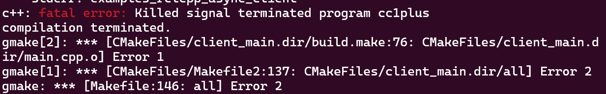

| 环境 | WSL2 Ubuntu 24.04 |
| :--: | :---------------: |

最近在学习[ROS2](https://fishros.com/d2lros2/#/), 准备无人机赛事所用的激光雷达. 方便考虑, 最终用的是WSL, 没有折腾虚拟机或者双系统. 在使用 `colcon build` 编译的时候有如下报错: 



尝试了增加swap交换空间, 重复 `colcon build `几次,不成. :sob:不仅是编译被kill了, 鼠鼠我啊也要被kill了, 鼠鼠真想一拳把显示器屏幕打穿(实际上是分配的memory仍然不够).:sob:

其原因是内存不足导致编译中断. 可以减少cmake编译时的进程数量, 如 `make -j4`. 对于 colcon, 在[此处](https://github.com/ros2/ros2_documentation/issues/3935)寻得了解决方法, 可以在 `colcon build` 之前指定makeflag. 比如:

```shell
MAKEFLAGS="-j2" colcon build
```

编译时间可能会变长, 但是稳. 这是较常用的办法. 如下, ~~道爷我~~成了.


